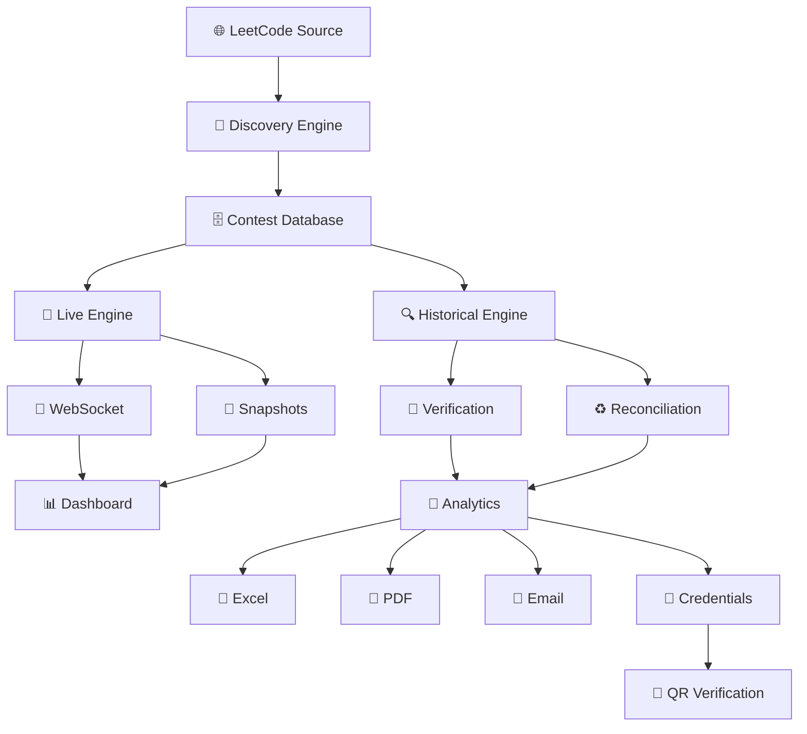

# 🟢 NANDHA LEETCODE INTELLIGENCE

### 🏫 Nandha Engineering College • Erode

**Official Automated Weekly Contest Tracking • Performance Intelligence • Verification • Reporting**

<p align="center">


</p>

<p align="center">

### ⚡ TRACK • 🔍 VERIFY • 📊 ANALYZE • 📑 REPORT • 🏆 RECOGNIZE

</p>

---

## 🎯 What Is This?

**Nandha LeetCode Intelligence** is an institutional-grade platform built for **Nandha Engineering College** to automatically track and analyze student participation across LeetCode Weekly Contests.

It replaces fragmented manual tracking with one centralized intelligence pipeline:

```text
🌐 LeetCode
     ↓
🔎 Contest Discovery
     ↓
🔴 Live Tracking
     ↓
🔍 Verification
     ↓
🧠 Performance Intelligence
     ↓
📊 Dashboard
     ↓
📗 Excel + 📄 PDF
     ↓
📧 Automated Reports
     ↓
🏅 Digital Verification
```

> **One institution. One verified performance layer. Every weekly contest.**

---

# 🏫 INSTITUTIONAL COVERAGE

### 🛡️ CSE — Cyber Security

`CSE(CS)`

### 🌐 CSE — Internet of Things

`CSE(IOT)`

### 🎓 Academic Batches

| Batch       | Year     |
| ----------- | -------- |
| `2025–2029` | II Year  |
| `2024–2028` | III Year |
| `2023–2027` | IV Year  |

### 👥 Student Coverage

> **220+ students** tracked through automated contest and problem-solving analytics.

---

# ⚡ THE SUNDAY ENGINE

Every Sunday, the platform runs a dedicated contest intelligence cycle.

```text
                 🏆 WEEKLY CONTEST
                        │
                        ▼
                 🔎 DISCOVERY
                        │
                        ▼
                  📅 SCHEDULED
                        │
                        ▼
                    🔴 LIVE
                        │
             ┌──────────┴──────────┐
             ▼                     ▼
        📡 TELEMETRY          🔌 WEBSOCKET
             │                     │
             └──────────┬──────────┘
                        ▼
                 📸 FINAL SNAPSHOT
                        │
                        ▼
                 🧠 ANALYTICS
                        │
                        ▼
                 📊 REPORTING
```

### ⏱️ Session

**08:00 AM IST** → Baseline Snapshot
**08:00–09:30 AM IST** → Live Monitoring
**09:30 AM IST** → Final Snapshot & Ranking
**After Contest** → Analytics + Reports

### 📈 Progress

```text
CURRENT SOLVED − BASELINE SOLVED
              ↓
       WEEKLY PROGRESS
```

---

# 🔴 LIVE ≠ 🔍 HISTORY

One of the core architectural principles of the platform is **strict separation between live contest tracking and historical reconciliation**.

```text
┌─────────────────────────────────┐
│ 🔴 SUNDAY LIVE ENGINE           │
│                                 │
│ 📡 Telemetry                    │
│ ⚡ Polling                      │
│ 🔌 WebSocket                    │
│ 📊 Live Leaderboard             │
│ 📸 Snapshots                    │
│                                 │
│ 🔒 PROTECTED                    │
└────────────────┬────────────────┘
                 │
          🛡️ HARD BARRIER
                 │
┌────────────────▼────────────────┐
│ 🔍 HISTORICAL ENGINE             │
│                                 │
│ 🏆 Completed Contests            │
│ ♻️ Reconciliation                │
│ 🧮 Verification                  │
│ 🧹 Deduplication                 │
│                                 │
│ 🚫 NEVER MUTATES LIVE/SCHEDULED │
└─────────────────────────────────┘
```

The historical engine is designed to work independently without interfering with the existing Sunday live workflow.

---

# 🔮 BUILT FOR EVERY FUTURE CONTEST

The platform should not depend on manually changing:

```text
516 → 517 → 518 → 519
```

Instead, contest discovery follows the source dynamically:

```text
🌐 SOURCE
   ↓
🔎 DISCOVER
   ↓
🏆 IDENTIFY
   ↓
📅 RESOLVE DATE
   ↓
🔗 RESOLVE URL
   ↓
🧭 DETECT STATUS
   ↓
⚙️ SELECT ENGINE
```

### 🔄 Lifecycle

```text
📅 SCHEDULED
      ↓
🔴 LIVE
      ↓
🏁 ENDED
      ↓
🔍 VERIFYING
      ↓
✅ VERIFIED
      ↓
📊 PUBLISHED
      ↓
🔄 NEXT CONTEST
```

---

# 🧠 HISTORICAL INTELLIGENCE

Completed contests can be independently reconciled and verified.

### 🏆 Current Historical Scope

```text
510 → 511 → 512 → 513 → 514 → 515
```

### 🔎 The engine detects

`Missing Records` • `Duplicates` • `Wrong Mapping` • `Username Changes` • `Stale Data` • `Source Conflicts` • `Fetch Failures` • `Private Profiles`

---

# 🔐 DATA TRUST MODEL

> ## **Never guess missing data.**

The platform distinguishes between actual absence and inability to verify.

| State                         | Meaning                        |
| ----------------------------- | ------------------------------ |
| 🟢 `VERIFIED`                 | Source evidence confirmed      |
| 🟡 `VERIFIED_WITH_LIMITATION` | Verified with known limitation |
| 🟠 `PENDING_VERIFICATION`     | Verification in progress       |
| 🔴 `DATA_CONFLICT`            | Sources disagree               |
| ⚪ `NOT_VERIFIABLE`            | Evidence unavailable           |
| 🔵 `FETCH_FAILED`             | Temporary fetch failure        |

### 🚫 Critical Rule

```text
UNKNOWN       ≠ 0
PRIVATE       ≠ 0
FETCH FAILED  ≠ ABSENT
UNAVAILABLE   ≠ NOT ATTENDED
```

This prevents incomplete source data from being incorrectly presented as student inactivity.

---

# 📊 PERFORMANCE INTELLIGENCE

The platform transforms raw contest activity into student-level insights.

### 🏆 Contest Metrics

`🥇 Rank` • `⭐ Rating` • `🎯 Score` • `🧩 Solved` • `📈 Progress` • `🔥 Streak`

### 🧠 DSA Intelligence

```text
🔵 Dynamic Programming
🕸️ Graph
📦 Array
🔤 String
🌳 Tree
🔍 Binary Search
```

Interactive radar-based analysis provides a visual representation of student skill distribution.

---

# 📗 INSTITUTIONAL REPORTING

## Excel Intelligence

Automatically generate department- and batch-specific workbooks.

```text
📗 WEEKLY REPORT
│
├── 📄 Summary
│
├── 🛡️ CSE(CS)
│   ├── II Year
│   ├── III Year
│   └── IV Year
│
├── 🌐 CSE(IOT)
│   ├── II Year
│   ├── III Year
│   └── IV Year
│
└── 📊 Performance Analysis
```

### 📅 Weekly Matrix

```text
02.08.2026
09.08.2026
16.08.2026
      ↓
Future Weekly Contests
```

### 🚦 Activity Indicators

🟢 Active
🟡 Low Activity
🔴 `0 (⚠️ Inactive)` — only when verified
⚪ Not Verifiable
🔵 Pending Fetch

---

# 📄 PDF + 📧 AUTOMATED REPORTING

The reporting pipeline:

```text
🏁 CONTEST COMPLETE
        ↓
🔍 VERIFY
        ↓
📊 ANALYZE
        ↓
📗 EXCEL
        ↓
📄 PDF
        ↓
📧 EMAIL
        ↓
📋 DELIVERY LOG
```

### 📮 Admin Reports Center

**Select Week → Choose Recipients → Preview → Send → Track**

Supports automated and on-demand institutional report dispatch.

---

# 🏅 EMERALD VAULT

### 💎 Version 3 — Emerald Vault Layer

The advanced student intelligence layer combines performance, achievements and digital identity.

```text
💎 EMERALD VAULT
       │
 ┌─────┼─────┐
 ▼     ▼     ▼
🧠    🏅    🪪
Skill  Awards Identity
```

### 🏅 Achievement Shelf

| Badge                   | Recognition             |
| ----------------------- | ----------------------- |
| 💯 **100 Club**         | 100+ verified problems  |
| 🔥 **Streak Master**    | 5+ consecutive contests |
| 🏆 **Contest Champion** | Top contest performance |
| ⚡ **Fast Solver**       | High solving efficiency |
| 🧠 **DSA Specialist**   | Strong DSA coverage     |
| 📈 **Weekly Improver**  | Consistent improvement  |

---

# 🪪 DIGITAL PERFORMANCE PASS

A shareable digital student identity containing:

**Student • Register Number • Department • Batch • LeetCode Profile • Achievements • QR Verification**

```text
┌──────────────────────────────┐
│ 🏫 NANDHA ENGINEERING        │
│                              │
│ 💎 DIGITAL PERFORMANCE PASS  │
│                              │
│ 👤 Student                  │
│ 🆔 Register No.             │
│ 🏢 Department               │
│ 🎓 Batch                    │
│ 💻 LeetCode                 │
│                              │
│             ▣               │
│          QR VERIFY           │
│                              │
│ 🔐 VERIFIED                 │
└──────────────────────────────┘
```

---

# 🔐 DIGITAL CREDENTIAL VERIFICATION

```text
📜 CERTIFICATE
      ↓
📱 QR
      ↓
🔗 VERIFY
      ↓
🆔 Verification ID
      ↓
🗄️ Database
      ↓
✅ Authenticity
```

The certificate, verification page, audit record and downloaded PDF must represent:

> **The same student + same contest + same verified record.**

---

# 🏗️ ARCHITECTURE



---

# 🧰 TECHNOLOGY

### 🎨 Frontend

`React 18` • `Vite` • `Tailwind CSS` • `Recharts` • `React Query`

### ⚙️ Backend

`Python 3.11+` • `FastAPI` • `Uvicorn` • `SQLAlchemy` • `Pytest`

### 📡 Real-Time

`WebSocket` • `Live Telemetry` • `Real-Time Leaderboard`

### 🗄️ Data

`SQLite` • `WAL Mode` • `Immutable Snapshots` • `Transactional Updates`

### 📑 Reporting

`Excel` • `PDF` • `Automated Email`

---

# 📸 PLATFORM PREVIEW

> Add your **real production screenshots** here — dashboard, leaderboard, reports and analytics.

```text
📊 DASHBOARD    🏆 LEADERBOARD

📑 REPORTS      🧠 ANALYTICS
```

---

# 🚀 QUICK START

### 1️⃣ Backend

```bash
python -m uvicorn backend.main:app --reload --host 0.0.0.0 --port 8000
```

### 2️⃣ Frontend

```bash
cd frontend
npm install
npm run dev
```

### 3️⃣ Open

```text
🌐 http://localhost:3000
```

---

# 🧪 TESTING

```bash
cd backend
pytest tests/
```

The platform uses automated testing to protect critical contest and data workflows.

---

# 🛡️ ENGINEERING PROMISE

```text
🎯 ACCURACY
    ↓
🔐 INTEGRITY
    ↓
⚡ AUTOMATION
    ↓
📊 INTELLIGENCE
    ↓
🏛️ INSTITUTIONAL SCALE
```

### **Verified data over guessed data.**

### **Automation over manual work.**

### **Evidence over assumptions.**

---

<div align="center">

# 🟢 NANDHA LEETCODE INTELLIGENCE

### **Track Every Contest. Verify Every Record. Understand Every Student.**

🏫 **Nandha Engineering College • Erode**

**⚡ Track • 🔍 Verify • 🧠 Analyze • 📊 Report • 🏆 Recognize**

</div>
