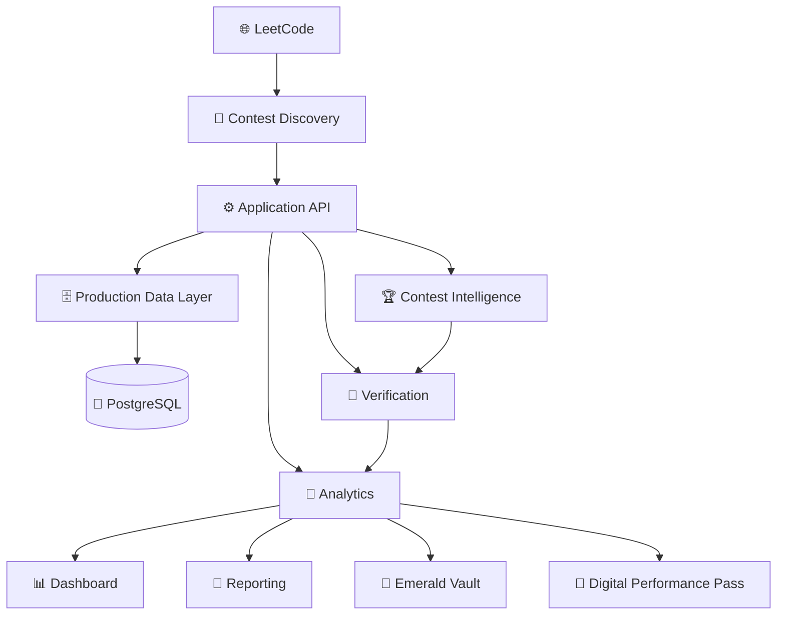

<div align="center">

# 🟢 NANDHA LEETCODE INTELLIGENCE

### **Institutional Contest Intelligence • Verification • Analytics • Recognition**

**Nandha Engineering College • Erode**

### **1500+ Students • One Institutional Intelligence Platform**

> **Track Every Contest. Verify Every Record. Understand Every Student.**

<br/>


</div>

---

# 🏛️ Institutional Intelligence

### Built for 1500+ Students. Engineered for Continuous Performance Visibility.

**Nandha LeetCode Intelligence** is a production-grade institutional performance platform designed to transform LeetCode activity into structured, verifiable and actionable academic intelligence.

The platform connects the complete performance lifecycle:

```text
Student Activity
      ↓
Data Collection
      ↓
Verification
      ↓
Normalization
      ↓
Performance Intelligence
      ↓
Institutional Analytics
      ↓
Reporting
      ↓
Recognition
```

It is designed not merely to **track contests**, but to provide a unified intelligence layer for understanding student participation, performance and progress at institutional scale.

---

# ⚡ Platform at a Glance

| Capability                     | Purpose                                                          |
| ------------------------------ | ---------------------------------------------------------------- |
| 🏆 Contest Intelligence        | Discover, track and process weekly contest activity              |
| 🔐 Evidence-Based Verification | Separate verified information from unavailable or uncertain data |
| 🧠 Performance Intelligence    | Convert activity into meaningful student-level signals           |
| 📊 Executive Analytics         | Surface institution and academic-group performance insights      |
| 📑 Automated Reporting         | Generate structured institutional reports                        |
| 💎 Emerald Vault               | Recognize verified student achievements                          |
| 🪪 Digital Performance Pass    | Represent verified student performance digitally                 |
| 🤖 Workflow Automation         | Reduce repetitive operational work                               |

---

# 📊 Built for Institutional Scale

```text
┌────────────────────────────────────────────────────────────┐
│                                                            │
│                  NANDHA LEETCODE INTELLIGENCE              │
│                                                            │
│             Institutional Performance Platform             │
│                                                            │
│                       1500+ STUDENTS                       │
│                                                            │
│    🏆 Contest Tracking   🔐 Verification   🧠 Intelligence │
│                                                            │
└────────────────────────────────────────────────────────────┘
```

The platform is designed around institutional-scale requirements:

```text
👥 1500+ Students
🏫 Multiple Academic Groups
🎓 Multiple Years
🏆 Weekly Contest Activity
📊 Historical Performance
🔐 Verified Records
📑 Institutional Reporting
```

> **Scale is represented using currently verified platform information.**

---

# 🎯 From Contest Tracking to Institutional Intelligence

Traditional contest tracking primarily answers:

> **Who participated?**

Nandha LeetCode Intelligence extends that workflow into a broader intelligence pipeline:

```text
Who participated?
        ↓
Can the participation be verified?
        ↓
What was the performance?
        ↓
How is the student progressing?
        ↓
What patterns exist?
        ↓
Which insights matter institutionally?
        ↓
What should be reported?
        ↓
Who should be recognized?
```

### The transformation

**Raw Activity → Verified Data → Intelligence → Action**

---

# 🏗️ Production Architecture

### A Unified Data Pipeline Connecting Contest Activity, Verification, Intelligence and Reporting



> Production architecture components should always correspond to the currently deployed implementation.

---

# 🧠 Intelligence Engines

### The Processing Layer Behind the Platform

The platform is organized around specialized processing layers rather than a single monolithic tracking workflow.

---

## 🔎 Contest Discovery Engine

Automatically identifies relevant contest information using available contest metadata and scheduling logic.

```text
Contest Metadata
      ↓
Schedule Evaluation
      ↓
Contest Identification
      ↓
Contest Lifecycle
```

This reduces dependency on manual contest configuration and establishes a consistent contest-processing workflow.

---

## ⚙️ Canonical Synchronization Pipeline

### Controlled Data Synchronization at Institutional Scale

Large student datasets are processed through controlled synchronization rather than uncontrolled concurrent requests.

```text
1500+ Students
      ↓
Controlled Batching
      ↓
Data Fetch
      ↓
Validation
      ↓
Normalization
      ↓
Persistence
      ↓
Verification
```

This architecture is intended to improve:

* Resource utilization
* Request control
* Failure isolation
* Database consistency
* Operational reliability
* Large-scale synchronization

> The objective is **reliable institutional synchronization**, not uncontrolled maximum concurrency.

---

## 🔐 Participation Verification Engine

Contest activity is evaluated against available evidence and participation conditions.

```text
Activity Evidence
      ↓
Timing / Contest Context
      ↓
Validation
      ↓
Participation Classification
      ↓
Verification State
```

This prevents the system from treating every available record as equivalent participation.

---

## 🔄 Reconciliation Engine

### Maintaining Data Coherence After Contest Processing

Collected information can be reconciled against available authoritative contest information.

```text
Collected Records
       +
Available Official Records
       ↓
   Reconciliation
       ↓
Conflict Detection
       ↓
Validated Result
       ↓
Canonical Record
```

The purpose is to maintain consistent downstream data for analytics, rankings and reporting.

---

# 🔐 Evidence-First Verification

## Evidence Over Assumptions

> ### **Never Guess Missing Data.**

External platform data can be unavailable, private, delayed, incomplete or temporarily inaccessible.

The platform therefore distinguishes between different verification states:

```text
🟢 VERIFIED
🟡 VERIFIED WITH LIMITATION
🟠 PENDING VERIFICATION
🔴 DATA CONFLICT
⚪ NOT VERIFIABLE
🔵 FETCH FAILED
```

### Critical Data Semantics

```text
UNKNOWN       ≠ 0
PRIVATE       ≠ 0
FETCH FAILED  ≠ ABSENT
UNAVAILABLE   ≠ NOT ATTENDED
```

This evidence-oriented approach prevents unavailable information from being silently converted into false negative results.

---

# 🧬 Student Performance Intelligence

### Turning Contest Activity into Meaningful Performance Signals

The platform organizes available student performance data into interpretable signals:

```text
🥇 Rank
⭐ Rating
🎯 Score
🧩 Solved
📈 Progress
🔥 Streak
🧠 Skill Signals
```

These signals support analysis of:

* Individual performance
* Contest progression
* Historical trends
* Improvement patterns
* Skill development
* Achievement recognition

---

# 📊 Executive Analytics

### From Student-Level Activity to Institution-Level Intelligence

The analytics layer provides structured views across multiple dimensions of performance.

```text
📈 Performance Trends
🏆 Contest Performance
🧠 Skill Intelligence
🎓 Academic Group Analysis
🔥 Streak Analysis
📊 Weekly Progress
```

### Intelligence Flow

```text
Student Records
      ↓
Performance Metrics
      ↓
Aggregated Insights
      ↓
Institutional Intelligence
      ↓
Decision Support
```

---

# 💎 Emerald Vault

## Verified Student Achievements

The **Emerald Vault** provides a dedicated recognition layer for verified achievements.

```text
💯 100 Club
🔥 Streak Master
🏆 Contest Champion
⚡ Fast Solver
🧠 DSA Specialist
📈 Weekly Improver
```

Recognition is designed around available performance evidence rather than unsupported manual claims.

---

# 🪪 Digital Performance Pass

### A Verifiable Digital Representation of Student Performance

The Digital Performance Pass can represent structured student achievement information.

```text
┌────────────────────────────────────┐
│       DIGITAL PERFORMANCE PASS     │
├────────────────────────────────────┤
│ Student                            │
│ Register Number                    │
│ Department                         │
│ Batch                              │
│ LeetCode Profile                   │
│ Achievements                       │
│ QR Verification                    │
│ Verification ID                    │
└────────────────────────────────────┘
```

Where implemented, verification identifiers provide a structured mechanism for validating the associated performance record.

> Digital credential capabilities should only be claimed where the corresponding implementation exists.

---

# 🏆 Weekly Contest Intelligence

### One Continuous Lifecycle from Discovery to Recognition

```text
🌐 DISCOVER
      ↓
📅 SCHEDULE
      ↓
🔴 LIVE
      ↓
📸 SNAPSHOT
      ↓
🔍 VERIFY
      ↓
🧠 ANALYZE
      ↓
📊 REPORT
      ↓
🏅 RECOGNIZE
```

This creates a consistent operational lifecycle for recurring contest activity.

---

# 🤖 Institutional Automation

### Automating the Contest-to-Reporting Lifecycle

Recurring institutional operations can follow a structured automated workflow:

```text
PRE-FLIGHT
    ↓
CONTEST DISCOVERY
    ↓
LIVE PROCESSING
    ↓
DATA VALIDATION
    ↓
FINALIZATION
    ↓
RECONCILIATION
    ↓
ANALYTICS
    ↓
REPORT GENERATION
    ↓
RECOGNITION
```

The goal is to make recurring workflows:

**Repeatable • Consistent • Auditable • Operationally Efficient**

---

# 📑 Institutional Reporting

### Transforming Verified Performance Data into Actionable Reports

```text
🏁 Contest Complete
        ↓
🔍 Verification
        ↓
🧠 Analysis
        ↓
📊 Result Processing
        ↓
📗 Excel
        ↓
📄 PDF
        ↓
📧 Distribution
```

Reporting is treated as an integrated part of the institutional workflow rather than a separate manual activity.

---

# ⚡ Engineered for Institutional Scale

### Controlled Processing for Large Student Datasets

The architecture can incorporate scale-oriented engineering practices where implemented:

```text
PostgreSQL Indexing
Pagination
Batch Processing
Connection Pooling
Background Processing
Efficient Data Fetching
API Optimization
Caching
Real-Time Updates
```

These capabilities should be enabled and documented according to the actual current implementation.

---

# 🔄 Real-Time Platform Experience

### Keeping Operational Views Synchronized with Backend Activity

Where real-time infrastructure is implemented:

```text
Backend Event
      ↓
WebSocket
      ↓
Frontend
      ↓
State Synchronization
      ↓
Dashboard Update
```

This provides near-real-time operational visibility without requiring users to repeatedly reload the application.

---

# 🛡️ Security & Access Control

### Role-Aware Protection for Institutional Data

```text
                 ADMIN
                   │
          Institution Scope
                   │
                   ▼
                  HOD
                   │
           Department Scope
                   │
                   ▼
            STAFF / MENTOR
                   │
          Assigned Scope
```

Potential security controls include only where implemented:

```text
🔐 Authentication
👤 Role-Based Authorization
🏫 Scope-Based Access
🛡️ Input Validation
🔑 Environment Secrets
🗄️ Database Security
🔒 Row-Level Security
```

### Security Principle

> **Frontend visibility is not security. Authorization must be enforced at the service and data-access layers.**

---

# 🌐 Technology Foundation

### Modern Technologies Powering the Platform

## Frontend Engineering

```text
React
TypeScript
Vite
Tailwind CSS
TanStack React Query
Recharts
```

## Backend Engineering

```text
Python
FastAPI
Uvicorn
```

## Data Layer

```text
PostgreSQL
Supabase — where applicable to the verified production deployment
```

## Real-Time Layer

```text
WebSocket
```

## Reporting Layer

```text
Excel
PDF
Email
```

> The production stack should always reflect the current deployed implementation.

---

# 📸 Product Experience

### A Visual View of the Institutional Intelligence Platform

## 📊 Executive Dashboard

*Add an actual production screenshot here.*

## 🏆 Contest Intelligence

*Add an actual production screenshot here.*

## 🧠 Student Performance

*Add an actual production screenshot here.*

## 💎 Emerald Vault

*Add an actual production screenshot here.*

## 📑 Institutional Reporting

*Add an actual production screenshot here.*

> **Use real platform screenshots only. Never use fabricated product imagery.**

---

# 📈 Current Platform Scale

```text
┌─────────────────────────────────────────┐
│        CURRENT PLATFORM CAPABILITIES    │
├─────────────────────────────────────────┤
│ 👥 1500+ Students                       │
│ 🏆 Weekly Contest Intelligence          │
│ 🔐 Evidence-Based Verification          │
│ 📊 Automated Analytics                  │
│ 📑 Institutional Reporting              │
│ 🪪 Performance Credentials              │
│ 💎 Achievement Recognition              │
└─────────────────────────────────────────┘
```

### Verified Scale Indicators

| Metric               | Current Representation |
| -------------------- | ---------------------- |
| Student Scale        | **1500+**              |
| Contest Intelligence | **Weekly**             |
| Verification         | **Evidence-Based**     |
| Analytics            | **Institutional**      |
| Reporting            | **Automated Workflow** |
| Recognition          | **Achievement-Based**  |

No unsupported claims are made regarding:

* Uptime percentage
* API request volume
* Response-time guarantees
* Accuracy percentages
* Database size
* Infrastructure capacity

---

# 🧪 Engineering Quality

### Reliability, Integrity, Maintainability and Operational Discipline

The platform engineering approach is centered around:

```text
✓ Automated Testing
✓ Production Validation
✓ Database Integrity
✓ API Reliability
✓ Authentication
✓ Responsive UI
✓ Performance Monitoring
```

Only capabilities verified in the current implementation should be represented as active production features.

---

# 🧭 Engineering Philosophy

### Principles That Shape the Platform

## 01 — Evidence First

Never convert uncertainty into false certainty.

## 02 — Single Source of Truth

Maintain authoritative normalized application records.

## 03 — Controlled Synchronization

Process external data through controlled and predictable workflows.

## 04 — Separation of Concerns

Keep ingestion, verification, persistence, analytics, reporting and presentation logically separated.

## 05 — Idempotent Processing

Repeated operations should avoid unnecessary duplication or corruption where supported by the implementation.

## 06 — Failure Awareness

External systems can fail or become unavailable. Failure must not automatically become absence.

## 07 — Security by Design

Authorization belongs at the service and data layers.

## 08 — Institutional Reliability

The platform should support recurring institutional operations consistently and transparently.

---

# 🔍 Data Integrity Model

### Trust the Evidence. Preserve the Uncertainty.

```text
AVAILABLE
    ↓
VALIDATE
    ↓
NORMALIZE
    ↓
STORE
    ↓
VERIFY
    ↓
ANALYZE
    ↓
REPORT
```

At every stage:

```text
No Evidence
      ≠
Negative Evidence
```

This principle is fundamental to reliable institutional intelligence.

---

# 🚀 Production Readiness

### Built Around Real Institutional Usage

The platform architecture is structured around:

```text
🌐 Application Delivery
⚙️ Backend Processing
🗄️ Persistent Data
🔐 Access Control
🔄 Synchronization
📊 Analytics
📑 Reporting
🤖 Automation
```

Production claims should be backed by the actual deployed environment and current implementation.

---

# 🧭 Platform Lifecycle

```text
┌─────────────────────────────────────────────────────────┐
│                                                         │
│                 STUDENT ACTIVITY                       │
│                        ↓                                │
│                 DATA COLLECTION                         │
│                        ↓                                │
│                    VALIDATION                           │
│                        ↓                                │
│                    VERIFICATION                         │
│                        ↓                                │
│                 PERFORMANCE DATA                        │
│                        ↓                                │
│              INSTITUTIONAL ANALYTICS                    │
│                        ↓                                │
│                  REPORTING                              │
│                        ↓                                │
│                 RECOGNITION                             │
│                                                         │
└─────────────────────────────────────────────────────────┘
```

---

# 🎯 From Manual Tracking to Institutional Intelligence

```text
Manual Tracking
      ↓
Automated Collection
      ↓
Verification
      ↓
Performance Intelligence
      ↓
Institutional Analytics
      ↓
Automated Reporting
      ↓
Student Recognition
```

The platform brings these stages together into a unified institutional workflow.

---

# 🌟 What Makes the Platform Different?

### Not Just a Contest Tracker.

It combines:

```text
🏆 Contest Intelligence
        +
🔐 Evidence-Based Verification
        +
🧠 Performance Intelligence
        +
📊 Institutional Analytics
        +
📑 Automated Reporting
        +
💎 Student Recognition
```

into one platform.

### The Core Value

> **Turn fragmented contest activity into trusted institutional intelligence.**

---

# 🗂️ Table of Contents

* [🏛️ Institutional Intelligence](#-institutional-intelligence)
* [⚡ Platform at a Glance](#-platform-at-a-glance)
* [📊 Built for Institutional Scale](#-built-for-institutional-scale)
* [🎯 From Contest Tracking to Institutional Intelligence](#-from-contest-tracking-to-institutional-intelligence)
* [🏗️ Production Architecture](#️-production-architecture)
* [🧠 Intelligence Engines](#-intelligence-engines)
* [🔐 Evidence-First Verification](#-evidence-first-verification)
* [🧬 Student Performance Intelligence](#-student-performance-intelligence)
* [📊 Executive Analytics](#-executive-analytics)
* [💎 Emerald Vault](#-emerald-vault)
* [🪪 Digital Performance Pass](#-digital-performance-pass)
* [🏆 Weekly Contest Intelligence](#-weekly-contest-intelligence)
* [🤖 Institutional Automation](#-institutional-automation)
* [📑 Institutional Reporting](#-institutional-reporting)
* [⚡ Engineered for Institutional Scale](#-engineered-for-institutional-scale)
* [🛡️ Security & Access Control](#️-security--access-control)
* [🌐 Technology Foundation](#-technology-foundation)
* [📸 Product Experience](#-product-experience)
* [📈 Current Platform Scale](#-current-platform-scale)
* [🧪 Engineering Quality](#-engineering-quality)
* [🧭 Engineering Philosophy](#-engineering-philosophy)
* [🚀 Production Readiness](#-production-readiness)

---

<div align="center">

# 🟢 NANDHA LEETCODE INTELLIGENCE

### **1500+ Students • One Institutional Intelligence Platform**

**Track Every Contest. Verify Every Record. Understand Every Student.**

🏫 **Nandha Engineering College • Erode**

### **⚡ TRACK • 🔐 VERIFY • 🧠 UNDERSTAND • 📊 ANALYZE • 📑 REPORT • 🏆 RECOGNIZE**

<br/>

**Built for Institutional Intelligence.**

</div>
