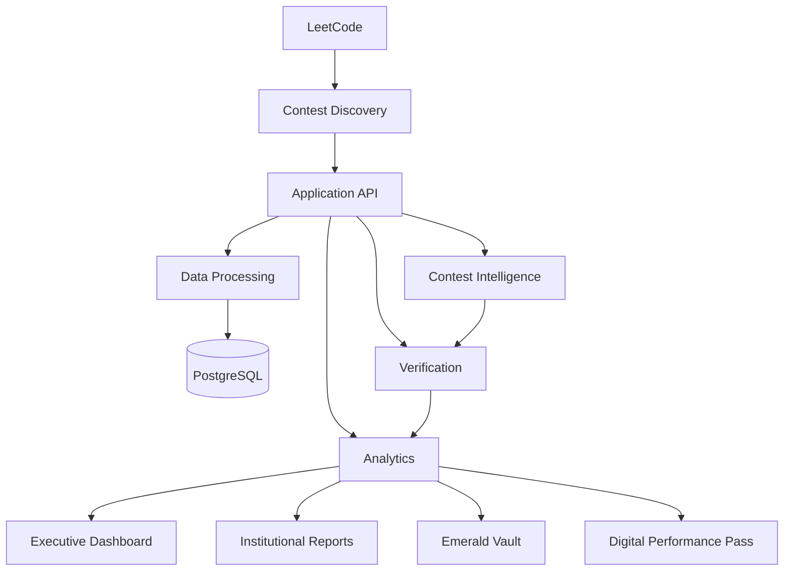

<div align="center">

# 🟢 NANDHA LEETCODE INTELLIGENCE

### Institutional Contest Intelligence • Verification • Analytics • Recognition

**Nandha Engineering College, Erode**

<p>
  
  
  
  
</p>

<p>
  
  
  
</p>

### *Track every contest. Verify every record. Understand student performance.*

</div>

---

## 📖 Table of Contents

<table>
<tr>
<td valign="top" width="33%">

- [Overview](#-overview)
- [Key Features](#-key-features)
- [Platform Scope](#-platform-scope)
- [System Architecture](#-system-architecture)
- [Core Processing Pipeline](#-core-processing-pipeline)
- [Contest Discovery Engine](#-contest-discovery-engine)
- [Student Synchronization](#-student-synchronization)

</td>
<td valign="top" width="33%">

- [Participation Verification](#-participation-verification)
- [Reconciliation Engine](#-reconciliation-engine)
- [Evidence-First Data Model](#-evidence-first-data-model)
- [Performance Intelligence](#-performance-intelligence)
- [Institutional Analytics](#-institutional-analytics)
- [Emerald Vault](#-emerald-vault)
- [Digital Performance Pass](#-digital-performance-pass)

</td>
<td valign="top" width="33%">

- [Weekly Contest Lifecycle](#-weekly-contest-lifecycle)
- [Reporting](#-reporting)
- [Security & Access Control](#-security--access-control)
- [Technology Stack](#-technology-stack)
- [Engineering Principles](#-engineering-principles)
- [Production Readiness](#-production-readiness)
- [Future Scope](#-future-scope)

</td>
</tr>
</table>

---

## 🧭 Overview

**Nandha LeetCode Intelligence** is an institutional performance platform that transforms raw LeetCode contest activity into structured, verifiable, and actionable academic intelligence.

It unifies contest tracking, data synchronization, participation verification, performance analytics, reporting, and achievement recognition into a single coherent workflow — built for the scale and rigor an institution actually needs.

Most tracking tools stop at one question. This platform goes much further:

```text
Who participated?
        ↓
Can the participation be verified?
        ↓
What was the performance?
        ↓
How is the student progressing?
        ↓
What patterns exist?
        ↓
What insights matter institutionally?
        ↓
What should be reported?
        ↓
Who should be recognized?
```

### The Core Transformation

```text
Raw Activity → Verified Data → Performance Intelligence
     → Institutional Analytics → Actionable Reporting → Recognition
```

> **In short:** contest noise in, institutional intelligence out.

---

## ✨ Key Features

| Feature | Description |
|---|---|
| 🔍 **Contest Intelligence** | Discover, track, and process recurring contest activity automatically |
| 🔄 **Student Synchronization** | Process large student datasets through controlled, reliable synchronization |
| ✅ **Participation Verification** | Validate participation using available evidence, not assumption |
| ⚖️ **Data Reconciliation** | Resolve inconsistencies between collected and authoritative records |
| 📊 **Performance Intelligence** | Analyze rank, rating, score, solved problems, and progress over time |
| 🏛️ **Institutional Analytics** | Aggregate individual performance into institution-level insight |
| 💎 **Emerald Vault** | Recognize verified student achievements with structured categories |
| 🪪 **Digital Performance Pass** | A structured, verifiable digital record of student performance |
| 📑 **Automated Reporting** | Generate institutional reports directly from processed results |
| ⚙️ **Workflow Automation** | Reduce repetitive operational and administrative work |
| 🔐 **Role-Based Access** | Enforce access according to institutional scope and hierarchy |
| ⚡ **Real-Time Updates** | Synchronized dashboard updates wherever real-time infra is implemented |

---

## 🏫 Platform Scope

Built from the ground up for institutional-scale requirements.

<table>
<tr><td>

- 🎓 **1,500+ students** actively tracked
- 🏢 Multiple academic groups
- 📅 Multiple academic years
- 🗓️ Weekly contest activity
- 🕰️ Historical performance information

</td><td>

- ✅ Verified performance records
- 📈 Institutional-level analytics
- 📋 Institutional reporting
- 🏆 Achievement recognition
- 🔒 Evidence-first data integrity

</td></tr>
</table>

> The scale and figures documented above reflect the currently verified platform state.

---

## 🏗️ System Architecture

The platform follows a layered architecture connecting external contest activity to institutional intelligence.



### Architectural Layers

```text
External Contest Platform → Contest Discovery → Application API
   → Data Processing → Persistence → Verification
   → Performance Intelligence → Institutional Analytics
   → Reporting & Recognition
```

> The architecture always reflects the components present in the current implementation — no aspirational diagrams.

---

## ⚙️ Core Processing Pipeline

```text
Student Activity → Data Collection → Validation → Normalization
   → Persistence → Verification → Performance Intelligence
   → Institutional Analytics → Reporting → Recognition
```

This design cleanly separates **external data collection** from **downstream analytics and institutional decision support**, keeping each stage independently testable and auditable.

---

## 🔎 Contest Discovery Engine

The Contest Discovery Engine identifies relevant contest information using available contest metadata and scheduling logic.

```text
Contest Metadata → Schedule Evaluation → Contest Identification → Contest Lifecycle
```

**Purpose**
- Identify relevant contests automatically
- Reduce manual contest configuration
- Establish a consistent contest-processing workflow
- Provide contest context for every downstream stage

---

## 🔄 Student Synchronization

Large student datasets are processed through **controlled synchronization**, not uncontrolled concurrent requests.

```text
1,500+ Students → Controlled Batching → Data Fetch
   → Validation → Normalization → Persistence → Verification
```

**Synchronization Objectives**
- Controlled request volume
- Better resource utilization
- Failure isolation
- Database consistency
- Operational reliability
- Large-scale data processing without degradation

> The goal is **reliable institutional synchronization** — not maximum raw concurrency.

---

## ✅ Participation Verification

Participation is never inferred solely from the presence or absence of an external record. The verification pipeline evaluates available evidence alongside contest context.

```text
Activity Evidence → Contest Context → Timing Validation
   → Participation Classification → Verification State
```

This distinguishes **confirmed participation** from information that simply **cannot currently be verified** — a critical distinction for institutional integrity.

---

## ⚖️ Reconciliation Engine

The Reconciliation Engine maintains consistency between collected information and available authoritative contest records.

```text
Collected Records + Available Official Records
   → Reconciliation → Conflict Detection
   → Validated Result → Canonical Record
```

**Purpose**
- Detect conflicting information
- Validate collected records
- Maintain a canonical, authoritative dataset
- Improve consistency for analytics
- Support reliable, defensible reporting

---

## 🧬 Evidence-First Data Model

### Evidence Over Assumptions

> **Golden Rule: Never guess missing data.**

External data may be unavailable, private, delayed, incomplete, temporarily inaccessible, or fail during retrieval — and the platform accounts for every one of those states.

```text
VERIFIED
VERIFIED WITH LIMITATION
PENDING VERIFICATION
DATA CONFLICT
NOT VERIFIABLE
FETCH FAILED
```

### Critical Semantics

```text
UNKNOWN       ≠ 0
PRIVATE       ≠ 0
FETCH FAILED  ≠ ABSENT
UNAVAILABLE   ≠ NOT ATTENDED
```

This prevents unavailable information from being silently and incorrectly converted into a false negative result.

---

## 📈 Performance Intelligence

Contest activity is converted into structured, comparable performance signals:

```text
Rank · Rating · Score · Solved Problems · Progress · Contest Streak · Skill Signals
```

These signals power:
- Individual performance analysis
- Contest progression tracking
- Historical trend analysis
- Improvement tracking
- Skill development analysis
- Achievement recognition

---

## 🏛️ Institutional Analytics

The analytics layer transforms student-level data into institution-level insight.

```text
Student Records → Performance Metrics → Aggregated Insights
   → Institutional Intelligence → Decision Support
```

**Analytical Areas**
- Performance trends
- Contest performance
- Skill intelligence
- Academic-group analysis
- Contest streak analysis
- Weekly progress
- Historical performance

---

## 💎 Emerald Vault

### Verified Achievement Recognition

The **Emerald Vault** is a dedicated recognition layer for verified student achievements.

<table>
<tr>
<td align="center">🏅<br><b>100 Club</b></td>
<td align="center">🔥<br><b>Streak Master</b></td>
<td align="center">🏆<br><b>Contest Champion</b></td>
</tr>
<tr>
<td align="center">⚡<br><b>Fast Solver</b></td>
<td align="center">🧠<br><b>DSA Specialist</b></td>
<td align="center">📈<br><b>Weekly Improver</b></td>
</tr>
</table>

Recognition is grounded in available performance **evidence**, never unsupported manual claims.

---

## 🪪 Digital Performance Pass

### A Verifiable Digital Performance Representation

```text
┌────────────────────────────────────┐
│       DIGITAL PERFORMANCE PASS      │
├────────────────────────────────────┤
│ Student                             │
│ Register Number                     │
│ Department                          │
│ Batch                               │
│ LeetCode Profile                    │
│ Achievements                        │
│ QR Verification                     │
│ Verification ID                     │
└────────────────────────────────────┘
```

Where implemented, verification identifiers provide a structured mechanism for validating the associated performance record.

> Digital credential functionality is only claimed where the corresponding implementation actually exists.

---

## 🔁 Weekly Contest Lifecycle

```text
DISCOVER → SCHEDULE → LIVE → SNAPSHOT → VERIFY → ANALYZE → REPORT → RECOGNIZE
```

| Stage | Purpose |
|---|---|
| **Discover** | Identify the relevant contest |
| **Schedule** | Determine contest timing and lifecycle |
| **Live** | Track contest activity |
| **Snapshot** | Capture available contest information |
| **Verify** | Validate participation and records |
| **Analyze** | Generate performance intelligence |
| **Report** | Produce institutional results |
| **Recognize** | Identify eligible achievements |

---

## 🤖 Institutional Automation

```text
Pre-Flight → Contest Discovery → Live Processing → Data Validation
   → Finalization → Reconciliation → Analytics
   → Report Generation → Recognition
```

**Automation Goals**

| Goal | Meaning |
|---|---|
| **Repeatable** | The same operational workflow executes consistently every time |
| **Consistent** | Processing follows defined stages and validation rules |
| **Auditable** | Data moves through clearly identifiable processing stages |
| **Efficient** | Automation removes repetitive institutional overhead |

---

## 📑 Reporting

```text
Contest Completion → Verification → Analysis → Result Processing
   → Excel → PDF → Distribution
```

Reporting is a **core institutional workflow**, not an afterthought bolted on manually.

---

## 🔐 Security & Access Control

```text
ADMIN → Institution Scope
  → HOD → Department Scope
    → STAFF / MENTOR → Assigned Scope
```

**Security Controls** *(where implemented)*
- Authentication
- Role-Based Authorization
- Scope-Based Access
- Input Validation
- Environment Secrets
- Database Security
- Row-Level Security

> **Security Principle:** Frontend visibility is not security. Authorization must be enforced at the service and data-access layers.

---

## 🛠️ Technology Stack

<table>
<tr><td valign="top">

**Frontend**

| Tech | Role |
|---|---|
| React | User interface |
| TypeScript | Type-safe development |
| Vite | Build tooling |
| Tailwind CSS | UI styling |
| TanStack Query | Server-state management |
| Recharts | Data visualization |

</td><td valign="top">

**Backend**

| Tech | Role |
|---|---|
| Python | Backend development |
| FastAPI | API framework |
| Uvicorn | ASGI application server |

**Database**

| Tech | Role |
|---|---|
| PostgreSQL | Persistent application data |
| Supabase | Verified production deployment |

</td><td valign="top">

**Real-Time**

```text
WebSocket
```

**Reporting**

```text
Excel
PDF
Email
```

</td></tr>
</table>

> The stack listed always reflects the currently deployed implementation.

---

## 🧾 Data Integrity

```text
AVAILABLE → VALIDATE → NORMALIZE → STORE → VERIFY → ANALYZE → REPORT
```

**Fundamental Rule**

```text
No Evidence  ≠  Negative Evidence
```

The system preserves uncertainty rather than silently converting missing information into a false negative.

---

## 🧩 Engineering Principles

| # | Principle | Description |
|---|---|---|
| 1 | **Evidence First** | Never convert uncertainty into false certainty |
| 2 | **Single Source of Truth** | Maintain authoritative, normalized application records |
| 3 | **Controlled Synchronization** | Process external data through predictable, bounded workflows |
| 4 | **Separation of Concerns** | Keep ingestion, verification, persistence, analytics, reporting, and presentation logically separate |
| 5 | **Idempotent Processing** | Repeated operations avoid unnecessary duplication or corruption |
| 6 | **Failure Awareness** | External systems can fail — failure must never silently become absence |
| 7 | **Security by Design** | Authorization belongs at the service and data layers |
| 8 | **Institutional Reliability** | Recurring operations execute consistently and transparently |

---

## 📊 Scalability & Reliability

```text
PostgreSQL Indexing · Pagination · Batch Processing · Connection Pooling
Background Processing · Efficient Data Fetching · API Optimization
Caching · Real-Time Updates
```

**Engineering Objective**

The goal is not to maximize raw request concurrency — it's to deliver:

```text
Controlled Processing + Data Integrity + Failure Isolation
   + Reliable Synchronization + Operational Consistency
```

> Capabilities are documented according to the actual implementation and deployment configuration — never aspirationally.

---

## 🖼️ Product Screenshots

> Use only authentic screenshots from the deployed platform. **No fabricated or AI-generated product images.**

| Section | Status |
|---|---|
| Executive Dashboard | _Add production dashboard screenshot_ |
| Contest Intelligence | _Add production contest-management screenshot_ |
| Student Performance | _Add production student-performance screenshot_ |
| Emerald Vault | _Add production achievement screenshot_ |
| Institutional Reporting | _Add production reporting screenshot_ |

---

## 📌 Current Platform Scope

| Area | Current Representation |
|---|---|
| Student Scale | **1,500+** |
| Contest Intelligence | **Weekly** |
| Verification | **Evidence-Based** |
| Analytics | **Institutional** |
| Reporting | **Automated Workflow** |
| Recognition | **Achievement-Based** |

This documentation intentionally avoids unsupported claims regarding uptime percentage, API request volume, response-time guarantees, accuracy percentages, database size, or infrastructure capacity — keeping it aligned strictly with **verifiable** platform information.

---

## 🧪 Engineering Quality

```text
Automated Testing · Production Validation · Database Integrity
API Reliability · Authentication · Responsive UI · Performance Monitoring
```

Only capabilities verified in the current implementation are represented as active production features.

---

## 🚀 Production Readiness

```text
Application Delivery → Backend Processing → Persistent Data
   → Access Control → Data Synchronization
   → Analytics → Reporting → Automation
```

Production-readiness claims are always backed by the actual deployed environment, implementation, and validation results.

---

## 🔮 Future Scope

Planned exploration areas — clearly separated from currently implemented features:

- Expanded institutional analytics
- Additional performance indicators
- Advanced historical trend analysis
- Extended digital credential capabilities
- Improved reporting workflows
- Additional automation
- Further scalability improvements
- Enhanced operational monitoring

---

## 🎯 Project Principles

```text
TRACK → VERIFY → UNDERSTAND → ACT
```

| Principle | Meaning |
|---|---|
| **Track** | Collect and organize recurring contest activity |
| **Verify** | Separate verified information from uncertain or unavailable data |
| **Understand** | Convert performance records into meaningful intelligence |
| **Act** | Use analytics, reporting, and recognition to support institutional decisions |

---

## 🏁 Conclusion

**Nandha LeetCode Intelligence** provides a unified approach to institutional competitive-programming performance management.

```text
Contest Activity → Data Collection → Verification
   → Performance Intelligence → Institutional Analytics
   → Reporting → Recognition
```

Its central engineering principle is **evidence-first processing**: unavailable, private, or failed external information is never incorrectly interpreted as zero participation or negative performance.

By combining contest intelligence, controlled synchronization, verification, analytics, reporting, and achievement recognition, the platform provides a structured foundation for **continuous visibility into student competitive-programming performance**.

---

<div align="center">

## 🟢 NANDHA LEETCODE INTELLIGENCE

**1,500+ Students • One Institutional Intelligence Platform**

### Track • Verify • Understand • Analyze • Report • Recognize

**Nandha Engineering College, Erode**

</div>
