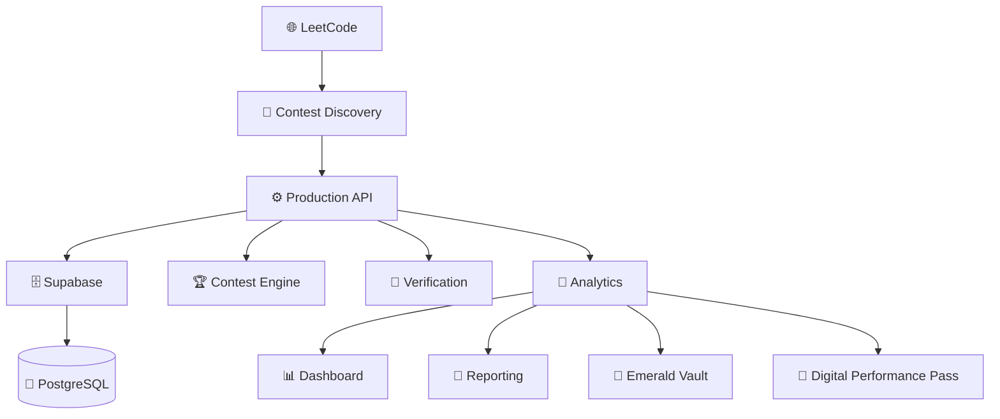

# 🚀 NANDHA LEETCODE INTELLIGENCE

# NEW GENERATION — 1500+ STUDENT INSTITUTIONAL PLATFORM

Create a completely new, premium GitHub README.md for the current version of the project.

The platform has now scaled to **1500+ students**.

The README must reflect this new institutional scale.

Do NOT present this as a small 200–300 student college project.

The positioning should be:

> **A production-grade institutional LeetCode intelligence and performance platform designed to manage 1500+ students at scale.**

---

# 🎯 NEW POSITIONING

Use:

# 🟢 NANDHA LEETCODE INTELLIGENCE

### Institutional Contest Tracking • Verification • Performance Intelligence • Reporting

**Nandha Engineering College • Erode**

Then:

> **Track Every Contest. Verify Every Record. Understand Every Student.**

---

# 📊 1500+ SCALE — HERO HIGHLIGHT

Make this one of the strongest visual elements.

Example:

```text
┌────────────────────────────────────────────────────────────┐
│                                                            │
│                 🟢 NANDHA LEETCODE INTELLIGENCE            │
│                                                            │
│       Institutional Student Performance Platform           │
│                                                            │
│                    👥 1500+ STUDENTS                       │
│                                                            │
│   🏆 Contest Tracking  •  🔐 Verification  •  📊 Analytics │
│                                                            │
└────────────────────────────────────────────────────────────┘
```

Use **1500+ Students** prominently.

Do not claim an exact number unless the repository/current production system verifies it.

---

# 🏛️ INSTITUTIONAL SCALE

Create a dedicated section:

## 🏛️ Built for Institutional Scale

Explain that the platform is designed to manage large-scale student performance data across:

```text
👥 1500+ Students
🏫 Multiple Academic Groups
🎓 Multiple Years
🏆 Weekly Contests
📊 Historical Performance
🔐 Verified Records
📑 Automated Reports
```

Do not invent department/year counts.

Use only verified current project information.

---

# ⚡ NEXT-GENERATION ARCHITECTURE

Position the current version as a scalable production system.

Show:

```text
                    👥 1500+ STUDENTS
                           │
                           ▼
                    🌐 PLATFORM
                           │
             ┌─────────────┼─────────────┐
             ▼             ▼             ▼
       🏆 CONTEST     🔐 VERIFY      📊 ANALYZE
             │             │             │
             └─────────────┼─────────────┘
                           ▼
                     🧠 INTELLIGENCE
                           │
             ┌─────────────┼─────────────┐
             ▼             ▼             ▼
          📊 UI          📑 REPORTS     🪪 CREDENTIALS
```

Make this the visual representation of the new platform.

---

# 🗄️ PRODUCTION DATABASE

The README MUST represent the actual current database architecture.

Before writing:

1. Inspect the repository.
2. Determine whether production uses Supabase/PostgreSQL.
3. If confirmed, prominently document:

```text
🗄️ Supabase
🐘 PostgreSQL
```

Do NOT continue presenting SQLite/WAL as the production database if it is no longer the production architecture.

If SQLite remains only for local/testing purposes, clearly label it as such.

---

# ⚡ SCALE + PERFORMANCE

Create a section:

## ⚡ Engineered for 1500+ Students

Mention only verified capabilities.

Potential topics:

```text
Indexed PostgreSQL queries
Pagination
Efficient data fetching
Caching
Connection pooling
Batch operations
Optimized APIs
Responsive dashboards
Background processing
Production monitoring
```

Only include capabilities that actually exist in the codebase.

Never invent architecture.

---

# 🏆 WEEKLY CONTEST INTELLIGENCE

Show the lifecycle:

```text
🌐 DISCOVER
     ↓
📅 SCHEDULE
     ↓
🔴 LIVE
     ↓
📸 SNAPSHOT
     ↓
🔍 VERIFY
     ↓
🧠 ANALYZE
     ↓
📊 REPORT
     ↓
🏅 RECOGNIZE
```

Make it visually prominent.

---

# 🔐 EVIDENCE-FIRST VERIFICATION

Create a standout section:

## 🔐 Evidence Over Assumptions

Highlight:

> **Never guess missing data.**

Then:

```text
🟢 VERIFIED
🟡 VERIFIED WITH LIMITATION
🟠 PENDING VERIFICATION
🔴 DATA CONFLICT
⚪ NOT VERIFIABLE
🔵 FETCH FAILED
```

And:

```text
UNKNOWN       ≠ 0
PRIVATE       ≠ 0
FETCH FAILED  ≠ ABSENT
UNAVAILABLE   ≠ NOT ATTENDED
```

This should remain a core identity of the platform.

---

# 🧠 STUDENT PERFORMANCE INTELLIGENCE

Show that the system converts contest activity into student-level intelligence.

Display:

```text
🥇 Rank
⭐ Rating
🎯 Score
🧩 Solved
📈 Progress
🔥 Streak
🧠 DSA Skills
```

Do not invent statistics.

---

# 💎 EMERALD VAULT

Show:

## 💎 Emerald Vault

### Verified Student Achievements

```text
💯 100 Club
🔥 Streak Master
🏆 Contest Champion
⚡ Fast Solver
🧠 DSA Specialist
📈 Weekly Improver
```

Use a premium visual presentation.

---

# 🪪 DIGITAL PERFORMANCE PASS

Show:

## 🪪 Digital Performance Pass

Present it as:

**A verified digital representation of student performance.**

Include:

```text
Student
Register Number
Department
Batch
LeetCode Profile
Achievements
QR Verification
Verification ID
```

Do not fabricate a QR image.

If there is an actual implementation, link to the relevant project section/path.

---

# 📊 EXECUTIVE ANALYTICS

Showcase:

```text
📈 Performance Trends
🏆 Contest Performance
🧠 Skill Intelligence
🎓 Academic Group Analysis
🔥 Streak Analysis
📊 Weekly Progress
```

Keep the section concise.

---

# 📑 AUTOMATED REPORTING

Show:

```text
🏁 Contest Complete
       ↓
🔍 Verify
       ↓
📊 Analyze
       ↓
📗 Excel
       ↓
📄 PDF
       ↓
📧 Email
```

Explain that reporting is part of the institutional workflow.

---

# 🏗️ ARCHITECTURE

Use Mermaid if supported.

First inspect the actual architecture.

If production is confirmed as Supabase/PostgreSQL, use an accurate diagram such as:



IMPORTANT:

Only use components confirmed from the actual repository.

---

# 🛠️ TECHNOLOGY STACK

Create professional badges.

Only list technologies actually used.

Organize:

### Frontend

```text
React
Vite
Tailwind CSS
React Query
Recharts
```

### Backend

```text
Python
FastAPI
Uvicorn
```

### Database

```text
Supabase
PostgreSQL
```

### Realtime

```text
WebSocket
```

### Reporting

```text
Excel
PDF
Email
```

Remove obsolete technologies from the production stack section.

---

# 📸 REAL PLATFORM PREVIEW

Create a premium screenshot section:

```text
## 📸 Platform Preview

### 📊 Executive Dashboard

[REAL SCREENSHOT]

### 🏆 Contest Intelligence

[REAL SCREENSHOT]

### 🧠 Student Analytics

[REAL SCREENSHOT]

### 💎 Emerald Vault

[REAL SCREENSHOT]

### 📑 Reporting

[REAL SCREENSHOT]
```

Use actual screenshots only.

Never generate fake screenshots.

If no screenshot assets exist, keep a clean placeholder and clearly mark it.

---

# 📈 SCALE METRICS

Create a section:

## 📈 Current Platform Scale

Use only verified current values.

At minimum:

```text
👥 1500+ Students
🏆 Weekly Contest Intelligence
🔐 Evidence-Based Verification
📊 Automated Analytics
📑 Automated Reporting
```

Do not invent:

* Number of contests
* Number of API requests
* Uptime percentage
* Response time
* Accuracy percentage
* Database size
* User count beyond verified 1500+

---

# 🚀 PRODUCTION STATUS

If production endpoints/status can be verified, show:

```text
🟢 Production
⚡ API
🗄️ Database
📊 Frontend
```

Do not claim “100% uptime” or similar unless measured and verified.

---

# 🧪 ENGINEERING QUALITY

Create:

## 🧪 Engineering

```text
Automated Testing
Production Validation
Database Integrity
Authentication
API Reliability
Responsive UI
Performance Monitoring
```

Only mention verified capabilities.

---

# 🔐 SECURITY

Create a concise security section.

Mention actual protections such as:

```text
Authentication
Authorization
Environment Secrets
Database Security
RLS
OTP Protection
Input Validation
```

Only if implemented.

Never expose secrets or sensitive configuration.

---

# 🎨 README VISUAL DESIGN

The README itself must feel premium.

Use:

* Centered hero
* Controlled emoji usage
* Badges
* Short paragraphs
* Tables
* Mermaid diagrams
* Section separators
* Strong headings
* Whitespace
* Consistent terminology

Avoid huge walls of text.

Avoid repeating the same information.

---

# 🧭 TABLE OF CONTENTS

Add:

```text
Overview
Why It Exists
Current Scale
Core Features
Contest Engine
Verification
Performance Intelligence
Emerald Vault
Digital Performance Pass
Architecture
Technology
Platform Preview
Production
Testing
Security
Quick Start
Engineering Principles
```

---

# 💡 WHY THIS PLATFORM MATTERS

Create a short section:

## 🎯 From Manual Tracking to Institutional Intelligence

Explain the transformation:

```text
Manual Tracking
      ↓
Automated Collection
      ↓
Verification
      ↓
Performance Intelligence
      ↓
Institutional Reporting
      ↓
Student Recognition
```

Keep it concise and professional.

---

# 🏆 FINAL STATEMENT

End with:

<div align="center">

# 🟢 NANDHA LEETCODE INTELLIGENCE

### **1500+ Students • One Institutional Intelligence Platform**

**Track Every Contest. Verify Every Record. Understand Every Student.**

🏫 **Nandha Engineering College • Erode**

**⚡ Track • 🔍 Verify • 🧠 Analyze • 📊 Report • 🏆 Recognize**

</div>

---

# 🚨 FINAL RULES

Before committing README.md:

* Inspect the repository.
* Verify the current production architecture.
* Verify the 1500+ student scale.
* Remove outdated SQLite production claims if PostgreSQL is now production.
* Do not invent statistics.
* Do not invent URLs.
* Do not invent screenshots.
* Do not invent performance numbers.
* Do not expose secrets.
* Keep the README technically accurate.
* Keep it visually premium.
* Keep it concise enough to scan.
* Make the first screen impressive.

The final README should communicate:

> **Nandha LeetCode Intelligence has evolved from a contest tracker into a scalable institutional intelligence platform serving 1500+ students.**
