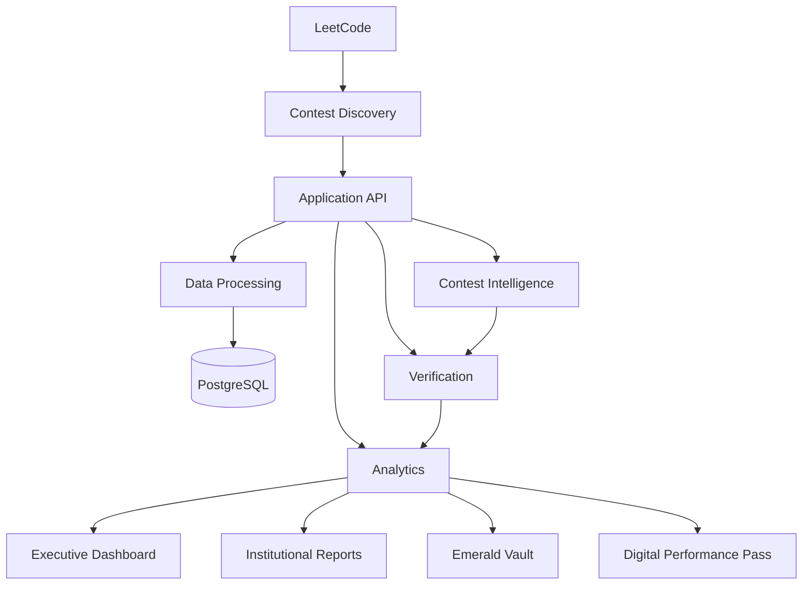

# NANDHA LEETCODE INTELLIGENCE

### Institutional Contest Intelligence, Verification, Analytics & Recognition

**Nandha Engineering College, Erode**


> **Track every contest. Verify every record. Understand student performance.**

---

## Overview

**Nandha LeetCode Intelligence** is an institutional performance platform designed to transform LeetCode contest activity into structured, verifiable and actionable academic intelligence.

The platform brings contest tracking, data synchronization, participation verification, performance analytics, reporting and achievement recognition into a unified workflow.

Instead of answering only:

> **Who participated?**

the platform extends the process to:

```text
Who participated?
        ↓
Can the participation be verified?
        ↓
What was the performance?
        ↓
How is the student progressing?
        ↓
What patterns exist?
        ↓
What insights matter institutionally?
        ↓
What should be reported?
        ↓
Who should be recognized?
```

### Core Transformation

```text
Raw Activity
     ↓
Verified Data
     ↓
Performance Intelligence
     ↓
Institutional Analytics
     ↓
Actionable Reporting
     ↓
Recognition
```

---

## Contents

* [Overview](#overview)
* [Key Features](#key-features)
* [Platform Scope](#platform-scope)
* [System Architecture](#system-architecture)
* [Core Processing Pipeline](#core-processing-pipeline)
* [Contest Discovery Engine](#contest-discovery-engine)
* [Student Synchronization](#student-synchronization)
* [Participation Verification](#participation-verification)
* [Reconciliation Engine](#reconciliation-engine)
* [Evidence-First Data Model](#evidence-first-data-model)
* [Performance Intelligence](#performance-intelligence)
* [Institutional Analytics](#institutional-analytics)
* [Emerald Vault](#emerald-vault)
* [Digital Performance Pass](#digital-performance-pass)
* [Weekly Contest Lifecycle](#weekly-contest-lifecycle)
* [Institutional Automation](#institutional-automation)
* [Reporting](#reporting)
* [Security & Access Control](#security--access-control)
* [Technology Stack](#technology-stack)
* [Data Integrity](#data-integrity)
* [Engineering Principles](#engineering-principles)
* [Scalability & Reliability](#scalability--reliability)
* [Product Screenshots](#product-screenshots)
* [Current Platform Scope](#current-platform-scope)
* [Production Readiness](#production-readiness)
* [Future Scope](#future-scope)
* [Conclusion](#conclusion)

---

# Key Features

| Feature                    | Description                                                         |
| -------------------------- | ------------------------------------------------------------------- |
| Contest Intelligence       | Discover, track and process recurring contest activity              |
| Student Synchronization    | Process student datasets through controlled synchronization         |
| Participation Verification | Validate participation using available evidence                     |
| Data Reconciliation        | Resolve inconsistencies between collected and authoritative records |
| Performance Intelligence   | Analyze rank, rating, score, solved problems and progress           |
| Institutional Analytics    | Aggregate student performance into institutional insights           |
| Emerald Vault              | Recognize verified student achievements                             |
| Digital Performance Pass   | Provide a structured digital representation of performance          |
| Automated Reporting        | Generate institutional reports from processed results               |
| Workflow Automation        | Reduce repetitive operational activities                            |
| Role-Based Access          | Control access according to institutional scope                     |
| Real-Time Updates          | Support synchronized dashboard updates where implemented            |

---

# Platform Scope

The platform is designed around institutional-scale requirements.

### Current Scope

* **1500+ students**
* Multiple academic groups
* Multiple academic years
* Weekly contest activity
* Historical performance information
* Verified performance records
* Institutional analytics
* Institutional reporting
* Achievement recognition

The documented student scale represents the currently verified platform information.

---

# System Architecture

The platform follows a layered architecture connecting external contest activity with institutional intelligence.



### Architectural Layers

```text
External Contest Platform
          ↓
Contest Discovery
          ↓
Application API
          ↓
Data Processing
          ↓
Persistence
          ↓
Verification
          ↓
Performance Intelligence
          ↓
Institutional Analytics
          ↓
Reporting & Recognition
```

The architecture should always reflect the components available in the current implementation.

---

# Core Processing Pipeline

The platform processes student contest information through a controlled data lifecycle.

```text
Student Activity
       ↓
Data Collection
       ↓
Validation
       ↓
Normalization
       ↓
Persistence
       ↓
Verification
       ↓
Performance Intelligence
       ↓
Institutional Analytics
       ↓
Reporting
       ↓
Recognition
```

This separates external data collection from downstream analytics and institutional decision support.

---

# Contest Discovery Engine

The Contest Discovery Engine identifies relevant contest information using available contest metadata and scheduling logic.

```text
Contest Metadata
       ↓
Schedule Evaluation
       ↓
Contest Identification
       ↓
Contest Lifecycle
```

### Purpose

* Identify relevant contests
* Reduce manual contest configuration
* Establish a consistent contest-processing workflow
* Provide contest context for downstream processing

---

# Student Synchronization

Large student datasets are processed through controlled synchronization rather than uncontrolled concurrent requests.

```text
1500+ Students
       ↓
Controlled Batching
       ↓
Data Fetch
       ↓
Validation
       ↓
Normalization
       ↓
Persistence
       ↓
Verification
```

### Synchronization Objectives

* Controlled request volume
* Better resource utilization
* Failure isolation
* Database consistency
* Operational reliability
* Large-scale data processing

The objective is **reliable institutional synchronization**, not uncontrolled maximum concurrency.

---

# Participation Verification

Participation is not determined solely from the presence or absence of an external record.

The verification pipeline evaluates available evidence and contest context.

```text
Activity Evidence
       ↓
Contest Context
       ↓
Timing Validation
       ↓
Participation Classification
       ↓
Verification State
```

This allows the platform to distinguish confirmed participation from information that cannot currently be verified.

---

# Reconciliation Engine

The Reconciliation Engine maintains consistency between collected information and available authoritative contest information.

```text
Collected Records
       +
Available Official Records
       ↓
Reconciliation
       ↓
Conflict Detection
       ↓
Validated Result
       ↓
Canonical Record
```

### Purpose

* Detect conflicting information
* Validate collected records
* Maintain canonical application data
* Improve consistency for analytics
* Support reliable reporting

---

# Evidence-First Data Model

## Evidence Over Assumptions

A core principle of the platform is:

> **Never guess missing data.**

External data may be:

* Unavailable
* Private
* Delayed
* Incomplete
* Temporarily inaccessible
* Failed during retrieval

The platform therefore distinguishes between different verification states.

```text
VERIFIED
VERIFIED WITH LIMITATION
PENDING VERIFICATION
DATA CONFLICT
NOT VERIFIABLE
FETCH FAILED
```

### Critical Semantics

```text
UNKNOWN       ≠ 0
PRIVATE       ≠ 0
FETCH FAILED  ≠ ABSENT
UNAVAILABLE   ≠ NOT ATTENDED
```

This prevents unavailable information from being silently converted into false negative results.

---

# Performance Intelligence

The platform converts contest activity into structured performance signals.

### Performance Signals

```text
Rank
Rating
Score
Solved Problems
Progress
Contest Streak
Skill Signals
```

These signals can support:

* Individual performance analysis
* Contest progression
* Historical trend analysis
* Improvement tracking
* Skill development analysis
* Achievement recognition

---

# Institutional Analytics

The analytics layer transforms student-level performance data into institution-level insights.

```text
Student Records
       ↓
Performance Metrics
       ↓
Aggregated Insights
       ↓
Institutional Intelligence
       ↓
Decision Support
```

### Analytical Areas

* Performance trends
* Contest performance
* Skill intelligence
* Academic-group analysis
* Contest streak analysis
* Weekly progress
* Historical performance

---

# Emerald Vault

## Verified Achievement Recognition

The **Emerald Vault** provides a dedicated recognition layer for verified student achievements.

### Recognition Categories

```text
100 Club
Streak Master
Contest Champion
Fast Solver
DSA Specialist
Weekly Improver
```

Recognition is intended to be based on available performance evidence rather than unsupported manual claims.

---

# Digital Performance Pass

## Verifiable Digital Performance Representation

The **Digital Performance Pass** provides a structured representation of student performance and achievement information.

```text
┌────────────────────────────────────┐
│       DIGITAL PERFORMANCE PASS     │
├────────────────────────────────────┤
│ Student                            │
│ Register Number                    │
│ Department                         │
│ Batch                              │
│ LeetCode Profile                   │
│ Achievements                       │
│ QR Verification                    │
│ Verification ID                    │
└────────────────────────────────────┘
```

Where implemented, verification identifiers provide a structured mechanism for validating the associated performance record.

Digital credential functionality should only be claimed where the corresponding implementation exists.

---

# Weekly Contest Lifecycle

The platform supports a continuous contest-processing lifecycle.

```text
DISCOVER
   ↓
SCHEDULE
   ↓
LIVE
   ↓
SNAPSHOT
   ↓
VERIFY
   ↓
ANALYZE
   ↓
REPORT
   ↓
RECOGNIZE
```

### Lifecycle Stages

| Stage     | Purpose                                |
| --------- | -------------------------------------- |
| Discover  | Identify the relevant contest          |
| Schedule  | Determine contest timing and lifecycle |
| Live      | Track contest activity                 |
| Snapshot  | Capture available contest information  |
| Verify    | Validate participation and records     |
| Analyze   | Generate performance intelligence      |
| Report    | Produce institutional results          |
| Recognize | Identify eligible achievements         |

---

# Institutional Automation

Recurring institutional operations follow a structured workflow.

```text
Pre-Flight
    ↓
Contest Discovery
    ↓
Live Processing
    ↓
Data Validation
    ↓
Finalization
    ↓
Reconciliation
    ↓
Analytics
    ↓
Report Generation
    ↓
Recognition
```

### Automation Goals

**Repeatable**

The same operational workflow can be executed consistently.

**Consistent**

Processing follows defined stages and validation rules.

**Auditable**

Data moves through identifiable processing stages.

**Operationally Efficient**

Automation reduces repetitive institutional work.

---

# Reporting

The reporting workflow converts verified performance information into structured institutional outputs.

```text
Contest Completion
       ↓
Verification
       ↓
Analysis
       ↓
Result Processing
       ↓
Excel
       ↓
PDF
       ↓
Distribution
```

Reporting is treated as part of the core institutional workflow rather than as an independent manual process.

---

# Security & Access Control

The platform follows a role- and scope-oriented access model.

```text
ADMIN
  ↓
Institution Scope
  ↓
HOD
  ↓
Department Scope
  ↓
STAFF / MENTOR
  ↓
Assigned Scope
```

### Security Controls

Where implemented, the platform may use:

* Authentication
* Role-Based Authorization
* Scope-Based Access
* Input Validation
* Environment Secrets
* Database Security
* Row-Level Security

### Security Principle

> **Frontend visibility is not security. Authorization must be enforced at the service and data-access layers.**

---

# Technology Stack

## Frontend

| Technology           | Role                           |
| -------------------- | ------------------------------ |
| React                | User interface                 |
| TypeScript           | Type-safe frontend development |
| Vite                 | Frontend build tooling         |
| Tailwind CSS         | UI styling                     |
| TanStack React Query | Server-state management        |
| Recharts             | Data visualization             |

## Backend

| Technology | Role                    |
| ---------- | ----------------------- |
| Python     | Backend development     |
| FastAPI    | API framework           |
| Uvicorn    | ASGI application server |

## Database

| Technology | Role                                         |
| ---------- | -------------------------------------------- |
| PostgreSQL | Persistent application data                  |
| Supabase   | Applicable to verified production deployment |

## Real-Time

```text
WebSocket
```

## Reporting

```text
Excel
PDF
Email
```

The technology stack should always represent the currently deployed implementation.

---

# Data Integrity

The platform follows an evidence-preserving data model.

```text
AVAILABLE
    ↓
VALIDATE
    ↓
NORMALIZE
    ↓
STORE
    ↓
VERIFY
    ↓
ANALYZE
    ↓
REPORT
```

### Fundamental Rule

```text
No Evidence
     ≠
Negative Evidence
```

The system should preserve uncertainty instead of silently converting missing information into a negative result.

---

# Engineering Principles

## 1. Evidence First

Never convert uncertainty into false certainty.

## 2. Single Source of Truth

Maintain authoritative and normalized application records.

## 3. Controlled Synchronization

Process external data through controlled and predictable workflows.

## 4. Separation of Concerns

Keep ingestion, verification, persistence, analytics, reporting and presentation logically separated.

## 5. Idempotent Processing

Repeated operations should avoid unnecessary duplication or corruption where supported by the implementation.

## 6. Failure Awareness

External systems can fail or become unavailable. Failure must not automatically become absence.

## 7. Security by Design

Authorization belongs at the service and data layers.

## 8. Institutional Reliability

Recurring institutional operations should execute consistently and transparently.

---

# Scalability & Reliability

The architecture can incorporate scale-oriented engineering practices where implemented and validated.

```text
PostgreSQL Indexing
Pagination
Batch Processing
Connection Pooling
Background Processing
Efficient Data Fetching
API Optimization
Caching
Real-Time Updates
```

### Engineering Objective

The goal is not simply to maximize request concurrency.

The goal is to provide:

```text
Controlled Processing
        +
Data Integrity
        +
Failure Isolation
        +
Reliable Synchronization
        +
Operational Consistency
```

Capabilities should be documented according to the actual implementation and deployment configuration.

---

# Real-Time Platform Experience

Where real-time infrastructure is implemented, backend events can be propagated to the frontend through WebSocket-based synchronization.

```text
Backend Event
       ↓
WebSocket
       ↓
Frontend
       ↓
State Synchronization
       ↓
Dashboard Update
```

This enables operational views to remain synchronized without requiring repeated manual page reloads.

---

# Product Screenshots

Use only authentic screenshots from the deployed platform.

## Executive Dashboard

> Add production dashboard screenshot here.

## Contest Intelligence

> Add production contest-management screenshot here.

## Student Performance

> Add production student-performance screenshot here.

## Emerald Vault

> Add production achievement screenshot here.

## Institutional Reporting

> Add production reporting screenshot here.

> **Do not use fabricated screenshots or AI-generated product images.**

---

# Current Platform Scope

| Area                 | Current Representation |
| -------------------- | ---------------------- |
| Student Scale        | **1500+**              |
| Contest Intelligence | **Weekly**             |
| Verification         | **Evidence-Based**     |
| Analytics            | **Institutional**      |
| Reporting            | **Automated Workflow** |
| Recognition          | **Achievement-Based**  |

The documentation intentionally avoids unsupported claims regarding:

* Uptime percentage
* API request volume
* Response-time guarantees
* Accuracy percentages
* Database size
* Infrastructure capacity

This keeps the README aligned with verifiable platform information.

---

# Engineering Quality

The platform engineering approach focuses on:

```text
Automated Testing
Production Validation
Database Integrity
API Reliability
Authentication
Responsive UI
Performance Monitoring
```

Only capabilities verified in the current implementation should be represented as active production features.

---

# Production Readiness

The platform architecture is organized around the following operational layers:

```text
Application Delivery
       ↓
Backend Processing
       ↓
Persistent Data
       ↓
Access Control
       ↓
Data Synchronization
       ↓
Analytics
       ↓
Reporting
       ↓
Automation
```

Production-readiness claims should be supported by the actual deployed environment, implementation and validation results.

---

# Platform Lifecycle

The complete institutional lifecycle can be represented as:

```text
Student Activity
       ↓
Data Collection
       ↓
Validation
       ↓
Verification
       ↓
Performance Data
       ↓
Institutional Analytics
       ↓
Reporting
       ↓
Recognition
```

This connects individual contest activity with institutional performance visibility.

---

# From Manual Tracking to Institutional Intelligence

The platform transforms a traditionally manual workflow into a structured intelligence pipeline.

```text
Manual Tracking
       ↓
Automated Collection
       ↓
Verification
       ↓
Performance Intelligence
       ↓
Institutional Analytics
       ↓
Automated Reporting
       ↓
Student Recognition
```

---

# What Makes the Platform Different?

## More Than a Contest Tracker

Nandha LeetCode Intelligence combines:

```text
Contest Intelligence
        +
Evidence-Based Verification
        +
Performance Intelligence
        +
Institutional Analytics
        +
Automated Reporting
        +
Student Recognition
```

into one institutional platform.

### Core Value

> **Transform fragmented contest activity into trusted institutional intelligence.**

---

# Future Scope

Future capabilities can be considered based on actual implementation requirements and institutional needs.

Potential areas include:

* Expanded institutional analytics
* Additional performance indicators
* Advanced historical trend analysis
* Extended digital credential capabilities
* Improved reporting workflows
* Additional automation
* Further scalability improvements
* Enhanced operational monitoring

Future capabilities should be clearly distinguished from currently implemented features.

---

# Project Principles

The project is built around four core ideas:

```text
TRACK
  ↓
VERIFY
  ↓
UNDERSTAND
  ↓
ACT
```

### Track

Collect and organize recurring contest activity.

### Verify

Separate verified information from uncertain or unavailable data.

### Understand

Convert performance records into meaningful intelligence.

### Act

Use analytics, reporting and recognition to support institutional decision-making.

---

# Conclusion

**Nandha LeetCode Intelligence** provides a unified approach to institutional competitive-programming performance management.

Instead of maintaining fragmented contest records, the platform connects:

```text
Contest Activity
      ↓
Data Collection
      ↓
Verification
      ↓
Performance Intelligence
      ↓
Institutional Analytics
      ↓
Reporting
      ↓
Recognition
```

Its central engineering principle is **evidence-first processing**: unavailable, private or failed external information should not be incorrectly interpreted as zero participation or negative performance.

By combining contest intelligence, controlled synchronization, verification, analytics, reporting and achievement recognition, the platform provides a structured foundation for continuous visibility into student competitive-programming performance.

---

<div align="center">

## NANDHA LEETCODE INTELLIGENCE

**1500+ Students • One Institutional Intelligence Platform**

**Track • Verify • Understand • Analyze • Report • Recognize**

**Nandha Engineering College, Erode**

</div>
