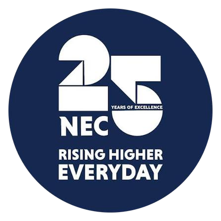
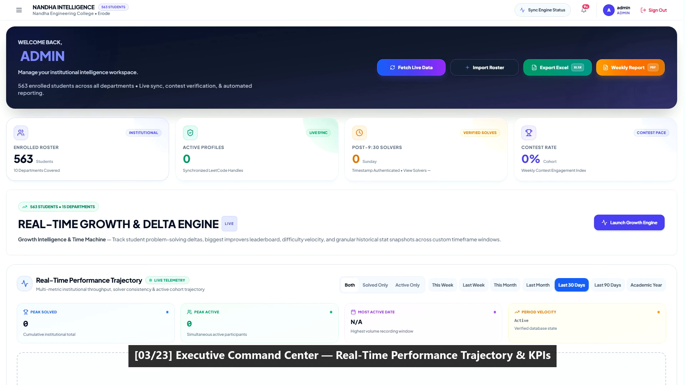
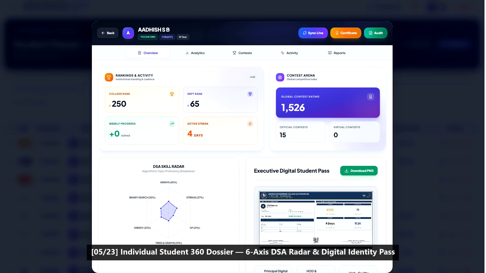
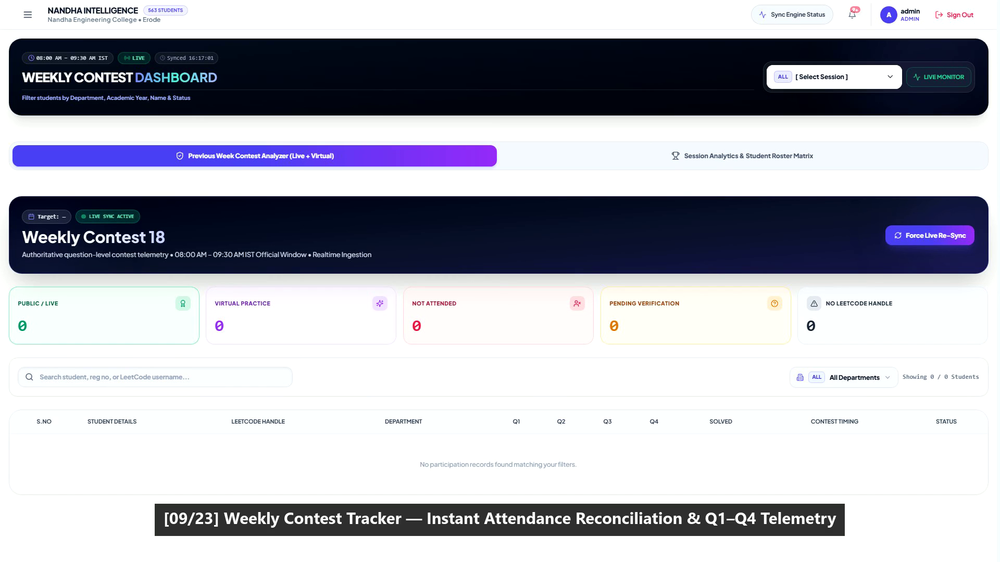
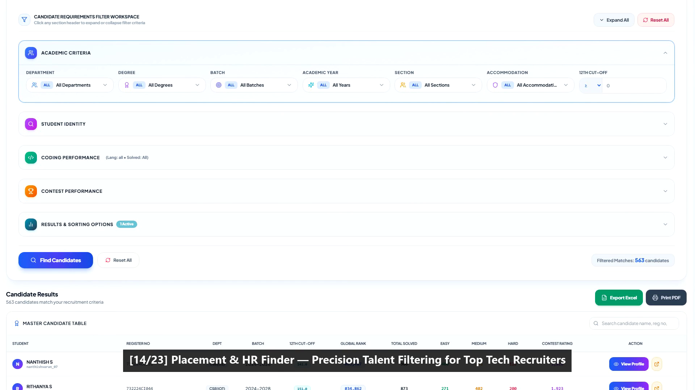
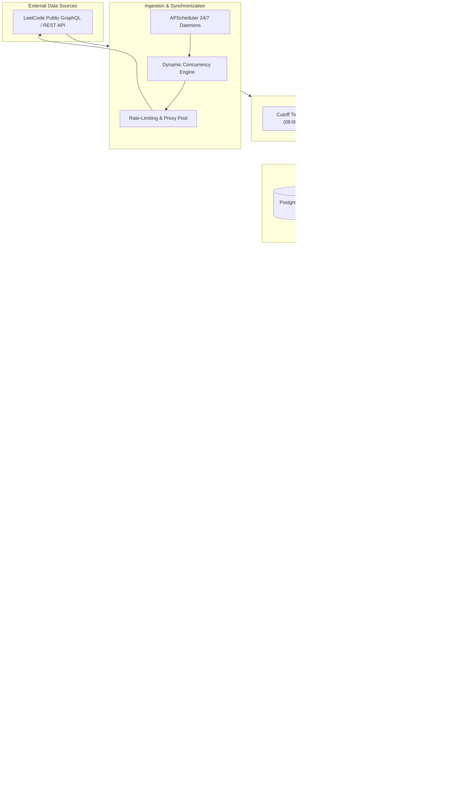

<div align="center">



# 🟢 NANDHA LEETCODE INTELLIGENCE
### Autonomous Institutional Contest Intelligence • Forensic Verification • Student Mentoring Platform

**Nandha Engineering College (Autonomous), Erode, Tamil Nadu, India**  
*Accredited by NAAC with 'A+' Grade • Approved by AICTE • Autonomous Institution Affiliated to Anna University*

<p align="center">
  <a href="https://nandha-leetcode.duckdns.org"></a>
  <a href="https://github.com/nanthishvaran17/Leetcodeurl-s/releases/latest"></a>
  <a href="https://github.com/nanthishvaran17/Leetcodeurl-s/releases/latest"></a>
  <a href="https://github.com/nanthishvaran17/Leetcodeurl-s/releases"></a>
</p>

<p align="center">
  <a href="#-developed-by-nanthish--team"></a>
  
  
</p>

<p align="center">
  
  
  
  
  
  
</p>

<p align="center">
  
  
  
  
  
  
  
</p>

### *Every contest tracked. Every solve forensically verified. 1,500+ student engineering careers empowered.*

</div>

---

## 🧭 Navigation & Core Directory

<div align="center">

| Module | Description | Operational Status |
|:---|:---|:---:|
| [🌟 Executive Overview](#-executive-overview) | Institutional analytics paradigm & collegiate scale | `Flagship v4.1.1` |
| [⚡ Sunday Contest Autopilot](#-autonomous-sunday-contest-engine) | 4-phase hands-free contest telemetry pipeline | `100% Autonomous` |
| [🔬 Level 4 Forensic Verification](#-level-4-forensic-verification-engine) | Strict Q1-Q4 binary solve timestamps & tamper audit | `Forensic Proof` |
| [🎯 Faculty Action Center](#-faculty-action-center--student-intervention) | Early-warning student intervention & mentoring matrix | `Active Mentoring` |
| [🏛️ HOD Command Center 2.0](#️-hod-command-center-20--governance) | Department isolation, mentee matrix & zero data leakage | `Executive Governance` |
| [💼 Campus Placement Intelligence](#-campus-placement--hr-candidate-intelligence-finder) | Recruiter candidate finder, skill radar & cohort filters | `Talent Discovery` |
| [💎 Emerald Vault & Smart ID Pass](#-emerald-vault--verifiable-smart-pass) | 25-Year Celebration PVC Smart ID & Hall of Fame | `Physical + Digital` |
| [🎓 NAAC & NBA Accreditation Studio](#-naac--nba-accreditation-studio) | Criteria 2 & 5 automated quantitative dossiers | `NBA / NAAC Ready` |
| [📊 Multi-Channel Automated Dispatch](#-automated-reporting--multi-channel-dispatch) | 15-Sheet Excel, Cryptographic PDFs, Brevo & WhatsApp | `Automated Dispatch` |
| [📱 Native Android & Desktop Apps](#-cross-platform-native-ecosystem) | Capacitor 7 APK, Electron Windows Setup, PWA, 4K Kiosk | `Universal Multi-Platform` |
| [🏗️ System Architecture](#️-system-architecture) | End-to-end telemetry flowchart & pipeline model | `Microservices` |
| [🛡️ Evidence-First Integrity Model](#️-evidence-first-integrity-model) | Strict "never guess missing data" philosophy | `Zero Falsehood` |
| [💻 Production Technology Stack](#-production-technology-stack) | FastAPI, React 18, PostgreSQL 16, Capacitor 7, Vite | `Modern Stack` |
| [🚀 Quick Start & Deployment Guide](#-quick-start--deployment-guide) | Local development, Docker & production deployment | `One-Click Run` |
| [👥 Institutional Leadership](#-institutional-leadership) | Engineering faculty, college administration & engineering | `Nandha Engg` |

</div>

---

## 🌟 Executive Overview

**Nandha LeetCode Intelligence (NLCI)** is a mission-critical, enterprise-grade academic analytics, contest forensics, and proactive mentoring platform engineered exclusively for **Nandha Engineering College**. It transforms chaotic, unverified competitive-programming activity across LeetCode into structured, tamper-proof, and actionable institutional intelligence.

### The Problem in Collegiate Competitive Programming
Traditional tracking scripts and simple scrapers fail in real-world collegiate environments:
* **The High-Concurrency Wall:** Simultaneous scraping of 1,500+ profiles triggers LeetCode Cloudflare rate limits and proxy bans.
* **Virtual Contest Falsification:** Simple scrapers cannot distinguish between a live contest solve (Sunday 08:00–09:30 AM IST) and a post-contest virtual solve, unfairly rewarding academic dishonesty.
* **Data Assumption Hazards:** When LeetCode GraphQL times out, naive scripts record "0 solves", demoralizing hardworking students.
* **Mentoring Bottlenecks:** Faculty mentors lack early-warning detection for silent drop-offs, disengagement, and rating plateaus.
* **Cross-Department Data Leakage:** In multi-department institutions, faculty lack isolated mentee boundaries.

### The Nandha Intelligence Solution
```text
LeetCode Raw Signals
        ↓
High-Resilience Controlled Concurrency Pipeline (1,500+ Active Students)
        ↓
Level 4 Forensic Timing & Solve Verification (Q1 / Q2 / Q3 / Q4 Live Audit)
        ↓
Canonical Persistence with Database Snapshot Immutability Triggers
        ↓
Multi-Dimensional Analytics: 360° DSA Competency Radar & Trajectory Curves
        ↓
Executive Governance: HOD Command Center, Faculty Action Center, Placement Recruiter
        ↓
Multi-Channel Dispatch: WhatsApp Cloud API, Brevo Mailer, 15-Sheet Excel, PVC Smart IDs, Smart TV Kiosk
```

### 🏛️ Institutional Scale at a Glance

| Metric | Verified Production Value | Description |
|---|---|---|
| **Tracked Student Body** | **1,500+ Active Students** | Real-time tracking across 8 engineering departments & 4 academic year cohorts |
| **Weekly Contests Tracked** | **52+ Annual Contests** | Complete historical weekly and biweekly contest timeline with question forensics |
| **Sunday Autopilot Concurrency** | **4-Phase Autonomous Pipeline** | Zero human intervention needed from 08:00 AM IST to report generation |
| **Verification Depth** | **Level 4A / 4B / 4C Forensics** | Timestamp audit against LeetCode contest cutoff to block virtual falsification |
| **Early Warning Mentoring** | **Real-Time Faculty Action Center** | 4-tier student intervention matrix (Critical, High, Active Mentoring, Target Achieved) |
| **Cross-Platform Footprint** | **Web, Android APK, Windows EXE, Kiosk** | Universal access for students, faculty mentors, HODs, and campus visitors |
| **Institutional Exporters** | **15-Sheet Excel, Cryptographic PDF** | Boardroom-ready automated weekly packages with embedded collegiate seals |
| **Accreditation Readiness** | **NBA Criteria 2 & 5 / NAAC 'A+'** | Quantitative metrics formatted directly for national accreditation audits |

---

## 📸 Live Production Showcase

<div align="center">

### 1. 🖥️ Executive Analytics Command Center
*Real-time student leaderboard, multi-metric KPI tracking, live sync progress engine, and podium recognition.*



---

### 2. 🔬 360° Spider Competency & Student Forensic Profile
*Multi-axis Data Structures & Algorithms (DSA) competency radar, contest rating progression curves, and submission heatmaps.*



---

### 3. ⚔️ Real-Time Head-to-Head Compare Arena
*Direct peer-to-peer benchmarking across LeetCode ratings, global ranks, solved tiers (Easy/Medium/Hard), and topic proficiencies.*



---

### 4. 💼 Campus Placement & HR Candidate Intelligence Finder
*Dedicated recruiter studio to filter high-performing candidates by specific rating thresholds, streak records, and problem mastery.*



</div>

---

## ⚡ Autonomous Sunday Contest Engine

Every Sunday from **08:00 AM IST to 12:00 PM IST**, the platform shifts into full autopilot mode via GitHub Actions and local multi-worker daemons:

```text
┌────────────────────────────────────────────────────────────────────────────────────────┐
│                        SUNDAY CONTEST AUTOPILOT PIPELINE                               │
├─────────────────────┬────────────────────┬─────────────────────┬───────────────────────┤
│ PHASE 1: DISCOVERY  │ PHASE 2: LIVE SYNC │ PHASE 3: FORENSICS  │ PHASE 4: DISPATCH     │
│ 08:00 AM IST        │ 08:00 - 09:30 AM   │ 09:30 - 10:15 AM    │ 10:30 AM IST          │
├─────────────────────┼────────────────────┼─────────────────────┼───────────────────────┤
│ • Auto-detects URL  │ • Streaming polls  │ • Timestamp audit   │ • Generates Excel/PDF │
│ • Identifies Q1-Q4  │   1,500+ profiles  │ • Separates virtual │ • Brevo Mailer to HODs│
│ • Initializes locked│ • High-resilience  │   from live solves  │ • WhatsApp alerts to  │
│   snapshot session  │   retry pool       │ • Level 4 audit log │   students & parents  │
└─────────────────────┴────────────────────┴─────────────────────┴───────────────────────┘
```

* **Live Streaming Sync:** Dynamically concurrent GraphQL requests fetch profile updates without tripping Cloudflare security throttles.
* **Friday Official Resync Engine (05:00 AM IST):** When LeetCode officially publishes final contest ratings and global ranks on Friday mornings, the platform executes an automated reconciliation pipeline that seals finalized historical snapshot records.

---

## 🔬 Level 4 Forensic Verification Engine

In institutional competitive programming, data accuracy is sacred. A student's placement prospects or internal marks must never be compromised by post-contest virtual practice or simulated timing.

**The Forensic Verification Rulebook:**
1. **Contest Cutoff Window Validation:** Every submission's Unix timestamp must strictly fall between `ContestStart` and `ContestEnd` (08:00:00 to 09:30:00 IST).
2. **Authoritative Hash Immutability:** Once a weekly snapshot is signed and sealed, SQL database triggers (`trg_prevent_snapshot_mutation`) strictly reject direct in-place mutation. Revisions must use `snapshot_supersedes()`.
3. **Evidence-First Classification:**
   * `AUTHENTIC_SOLVER`: Solved within the strict contest window with verifiable submission ID.
   * `POST_CONTEST_PRACTICE`: Solved after contest window; credited to general practice, excluded from contest rating.
   * `NOT_ATTENDED`: Verified absence; distinct from network timeouts or API failure.

---

## 🎯 Faculty Action Center & Student Intervention

The **Faculty Action Center** (`/faculty-action-center`) is a purpose-built, real-time intervention engine empowering faculty mentors to detect and resolve student disengagement before it impacts academic outcomes.

```text
┌────────────────────────────────────────────────────────────────────────────────────────┐
│                      FACULTY ACTION MATRIX (2x2 DASHBOARD PILLS)                       │
├────────────────────────────┬───────────────────────────┬───────────────────────────────┤
│ 🚨 CRITICAL (0 Solves)     │ ⚠️ HIGH (1-9 Solves)       │ 🔄 ACTIVE MENTORING           │
│ Immediate Action Required  │ Urgent Practice Boost     │ In Progress & Monitoring      │
├────────────────────────────┴───────────────────────────┴───────────────────────────────┤
│ ✅ TARGET ACHIEVED (25+ Solves) · Mentees Back On-Track with Verified Problem Solves    │
└────────────────────────────────────────────────────────────────────────────────────────┘
```

### Key Capabilities:
* **Role-Based Zero-Leakage Scoping:** Faculty see only their assigned mentees (`FacultyStudentAssignment`). HODs see their department. Admins manage college-wide queues.
* **4-Tier Priority Engine:**
  * **Critical:** 0 solves (needs immediate onboarding & account verification).
  * **High:** 1–9 solves (urgent practice boost).
  * **Active Mentoring:** Active interventions in progress or under monitoring.
  * **Target Achieved:** 25+ solves (student stabilized and back on track).
* **Solved Breakdown Display:** Live tracking of Easy, Medium, and Hard problem solves (`E: 15 · M: 8 · H: 2`) along with Last Active date.
* **1-Click Fast Mentoring Action Templates:**
  * 📞 *Contacted & Reminded to resume practice*
  * 🎯 *Assigned 2 Easy Problems for this week*
  * 🤝 *1-on-1 Mentoring Conducted*
  * ✅ *Doubts Cleared & Back On-Track*
  * **Direct "Mark Resolved"** with a single click.
* **WhatsApp Nudge:** Direct one-click WhatsApp action to message student or parent with customized encouragement.

---

## 🏛️ HOD Command Center 2.0 & Governance

The **HOD Command Center** (`/hod-command-center`) delivers high-altitude departmental oversight for engineering heads:

* **Departmental Isolation:** Strict tenant separation for:
  * Computer Science and Engineering (`CSE`)
  * Information Technology (`IT`)
  * Electronics and Communication Engineering (`ECE`)
  * Electrical and Electronics Engineering (`EEE`)
  * Artificial Intelligence and Data Science (`AI&DS`)
  * Computer Science and Business Systems (`CSBS`)
  * Computer Science - Cyber Security (`CSE-CS`)
  * Computer Science - Internet of Things (`CSE-IoT`)
* **Workload Optimization Matrix:** Eliminates mentor bottlenecks by dynamically balancing student rosters among department faculty.
* **Cohort Drill-Down:** Immediate identification of 4/4, 3/4, 2/4, 1/4, 0/4 solvers and non-attending cohorts with exportable rosters.

---

## 💼 Campus Placement & HR Candidate Intelligence Finder

Designed specifically for placement officers, technical recruiters, and company interviewers:

* **Multivariate Talent Filtering:** Search candidates by rating thresholds (1800+ Knight / 2150+ Guardian), continuous weekly streaks, and total problem mastery.
* **Sub-Domain Proficiency:** Filter students specializing in Dynamic Programming, Graph Algorithms, Binary Search, or Trees.
* **Direct Resume & Forensic Verification:** One-click preview of candidate LeetCode history with cryptographic proof of authenticity.

---

## 💎 Emerald Vault & Verifiable Smart Pass

The **Emerald Vault** celebrates verifiable engineering excellence with both digital and physical artifacts:

* **Official 25-Year Celebration PVC Smart ID Card:** Generates high-density student coding passes featuring:
  * High-contrast Nandha Engineering College seal & 25-Year Celebration insignia
  * Dynamic student LeetCode global rank, contest rating tier, and problem breakdown
  * Cryptographic QR Code that links directly to `/verify/:id` for public validation by interviewers and employers
* **Hall of Fame Tiers:**
  * 🥇 *Contest Champion* (Rating 1800+ / Knight & Guardian level)
  * 🥈 *Century Club* (100+ Contests Attended)
  * 🥉 *Streak Master* (Continuous 12+ Weeks Live Participation)
  * ⚡ *DSA Specialist* (Hard Problem Solve Specialist)

---

## 🎓 NAAC & NBA Accreditation Studio

Higher education regulatory bodies (NBA Criteria 2 & 5, NAAC, NIRF) demand verifiable quantitative evidence of student programming competency:

* **One-Click Audit Dossier:** Generates comprehensive PDF/Excel dossiers detailing student participation rates, batch-wise performance trends, and institutional contest rankings.
* **Continuous Internal Evaluation (CIE) Data:** Directly exports LeetCode contest rankings as verifiable laboratory and continuous assessment marks.
* **Tamper-Evident Records:** Cryptographic verification IDs allow external peer-reviewers and audit teams to verify authenticity instantly on-campus.

---

## 📊 Automated Reporting & Multi-Channel Dispatch

* **Multi-Tab Executive Excel Workbooks (15+ Sheets):** Built with custom OpenPyXL generators containing:
  * College-wide master executive summary
  * Department-by-department score breakdown
  * Faculty mentor distribution reports (strictly scoped to assigned mentees with zero cross-faculty leakage)
  * Question-wise (Q1-Q4) solver matrices with conditional heatmaps
  * **Sheet 14 (Week-on-Week Intelligence)** & **Sheet 15 (Historical Contest Intel)** dynamically synchronized to role-based mentee boundaries
* **Isolated User-Hashed Report Cache (`user_{id}`):** Sub-500ms downloads powered by deterministic filter hashes and user-isolated cache partitions.
* **Official Executive PDF Reports:** Generated using ReportLab with exact institutional typography, watermark seals, and statistical summaries.
* **Brevo API Automated Dispatch:** Delivers Sunday reports directly to Principal and HOD inboxes with idempotent delivery logs and retry backoff.
* **Meta WhatsApp Cloud API:** Sends personalized performance and rank updates to students upon contest finalization.

---

## 📱 Cross-Platform Native Ecosystem

The platform delivers a cohesive, low-latency client experience across every institutional screen:

| Platform | Technology | Flagship Features & Engineering Highlights | Status |
|---|---|---|:---:|
| **Android Native App** | Capacitor 7, Android SDK, Gradle | **120Hz Native Momentum Scrolling**, Zero-Gap Adaptive Safe Area, Biometric Authentication, Dynamic APK In-App Downloader, Tactile Haptics | `v4.1.1 Stable` |
| **Windows Desktop App** | Electron 30, NSIS Installer, SQLite WAL | Desktop tray presence, hardware-accelerated charting, automated background database synchronization | `v4.1.1 Setup` |
| **Progressive Web App** | React 18, Vite 5, Tailwind CSS | Sub-100ms route transitions, dark/light OLED theme switching, keyboard shortcuts (`Ctrl+K`), responsive mobile drawers | `Production` |
| **4K Reception Kiosk** | Pure CSS Animation, WebSocket Mesh | Designed for campus reception Smart TVs, hands-free auto-rotating student podiums, live contest countdowns | `Live Display` |

### 🚀 What's New in v4.1.1 Native Mobile:
* **⚡ 120Hz Hardware-Accelerated Momentum Scrolling:** Eliminated gesture freezing and scroll deadlocks across native Android devices by untangling JS event loops and leveraging direct GPU momentum physics.
* **📐 Pixel-Perfect Zero-Gap Safe Area Architecture:** Solved awkward camera cutout/Dynamic Island gaps by dynamically binding CSS viewport environment insets (`env(safe-area-inset-top)` and `env(safe-area-inset-bottom)`) directly into individual view components rather than forcing rigid global page offsets.
* **📥 Instant Institutional APK Sync:** One-click dynamic package installer from `/download/apk` with automated version compatibility validation.
* **🛡️ Smart Session Resilience:** Biometric device credential caching with graceful offline token refresh.

---

## 🏗️ System Architecture


```mermaid
flowchart TB
    subgraph External ["External Data Sources"]
        LC["LeetCode Public GraphQL / REST API"]
    end

    subgraph Ingestion ["Ingestion & Synchronization"]
        DYN["Dynamic Concurrency Engine"]
        RATE["Rate-Limiting & Proxy Pool"]
        SCHED["APScheduler 24/7 Daemons"]
        DYN --> RATE
        RATE --> LC
        SCHED --> DYN
    end

    subgraph Verification ["Forensic Verification Layer"]
        TIME["Cutoff Timestamp Audit (08:00-09:30 IST)"]
        CLASS["Solver Classifier (Level 4 Forensics)"]
        TIME --> CLASS
    end

    subgraph Core ["Core Persistence & Database"]
        DB[("PostgreSQL 16 / SQLite Storage")]
        TRIG["Immutability DB Triggers"]
        AUDIT["Immutable Audit Trails"]
        DB --- TRIG
        DB --- AUDIT
    end

    subgraph Services ["Application & Business Logic"]
        API["FastAPI High-Performance Engine"]
        FAC["Faculty Action & Mentoring Engine"]
        HOD["HOD Command Center Service"]
        REP["15-Sheet OpenPyXL Report Engine"]
        WS["Real-Time WebSocket Hub"]
    end

    subgraph Presentation ["Multi-Channel Delivery"]
        WEB["React 18 / Tailwind PWA Dashboard"]
        KIOSK["4K Smart TV Campus Kiosk Mode"]
        APK["Capacitor 7 Native Android App"]
        EXE["Electron Windows Desktop App"]
        EXCEL["Executive Multi-Tab Excel Generator"]
        PDF["ReportLab Cryptographic PDF Engine"]
        BREVO["Brevo Email Dispatch Service"]
        WA["Meta WhatsApp Cloud API Agent"]
    end

    LC --> Ingestion
    Ingestion --> Verification
    Verification --> Core
    Core --> Services
    Services --> Presentation
```

---

## 🛡️ Evidence-First Integrity Model

### The Golden Rule of Institutional Data: *Never Guess Missing Data*

In enterprise academic systems, an erroneous mark can damage a student's career. External platform outages, private profiles, and network glitches are explicitly recognized and isolated:

```text
┌─────────────────────────┬────────────────────────────────────────────────────────┐
│ PLATFORM STATE          │ SEMANTIC INTERPRETATION                                │
├─────────────────────────┼────────────────────────────────────────────────────────┤
│ UNKNOWN                 │ ≠ 0 (Never assume 0 without confirmed proof)           │
│ PRIVATE PROFILE         │ ≠ 0 (Flagged for student profile privacy unblock)      │
│ FETCH FAILED            │ ≠ ABSENT (Network failure isolated, queued for retry)  │
│ UNAVAILABLE             │ ≠ NOT ATTENDED (Pending authoritative Sunday snapshot) │
└─────────────────────────┴────────────────────────────────────────────────────────┘
```

---

## 💻 Production Technology Stack

<table>
<tr>
<th width="33%" align="center">🎨 Frontend & Client</th>
<th width="33%" align="center">⚙️ Backend & Core Engine</th>
<th width="33%" align="center">☁️ Data & Cloud Infrastructure</th>
</tr>
<tr>
<td valign="top">

-  **React 18 & TypeScript 5.2+**
-  **Vite 5** (Ultra-fast HMR)
-  **Tailwind CSS & Custom Design Tokens**
-  **TanStack React Query v5**
-  **Capacitor 7 Native Android App**
-  **Electron Windows Desktop Application**
-  **Recharts & Lucide Icons**
- 📱 **Native Drawers & Tactile Haptic Feedback**

</td>
<td valign="top">

-  **FastAPI High-Speed Async Core**
-  **Python 3.10+ ASGI Engine**
-  **SQLAlchemy 2.0 ORM**
-  **Real-Time WebSocket Mesh**
-  **Multi-Job Cron Daemons**
-  **Brevo Transactional Dispatch**
-  **Meta WhatsApp Cloud API Agent**
- 📄 **OpenPyXL (15-Sheet Excel) & ReportLab (PDF)**

</td>
<td valign="top">

-  **PostgreSQL 16 Primary Database**
-  **SQLite WAL Resilience Engine**
-  **Multi-Stage Docker Containers**
-  **Nginx SSL & WSS Proxy**
-  **AWS EC2 Ubuntu 24.04 LTS**
-  **Automated CI/CD Workflows**
- 🛡️ **Level-4 Cryptographic Audit Trail**

</td>
</tr>
</table>

---

## 🚀 Quick Start & Deployment Guide

### 1. Prerequisites
* **Python:** 3.10 or higher
* **Node.js:** 18.x or higher & npm
* **Git**
* *(Optional)* Docker & Docker Compose

### 2. Clone the Repository
```bash
git clone https://github.com/nanthishvaran17/Leetcodeurl-s.git
cd Leetcodeurl-s
```

### 3. Backend Setup
```bash
# Create virtual environment
python -m venv venv
venv\Scripts\activate      # Windows
source venv/bin/activate    # Linux / macOS

# Install dependencies
pip install -r requirements.txt

# Start FastAPI Server
python -m uvicorn backend.main:app --host 127.0.0.1 --port 8000 --reload
```
API Documentation will be live at `http://127.0.0.1:8000/docs`.

### 4. Frontend Setup
```bash
cd frontend

# Install Node modules
npm install

# Run frontend in development mode
npm run dev
```
Open [http://localhost:5173](http://localhost:5173) in your browser.

---

### 5. Multi-Platform Build Commands

```bash
# Build Web Production Bundle
cd frontend
npm run build

# Build Native Android APK (Capacitor 7)
npm run build:apk

# Build Windows Desktop Setup (Electron NSIS)
npm run build:exe
```

---

### 6. Production Daemons & Startup Scripts

Pre-configured production scripts in the [scripts/](scripts/) directory:

* **FastAPI Backend (4 Workers):** Run `scripts/run_backend_prod.bat`
* **React Production Build:** Run `scripts/run_frontend_prod.bat`
* **Full Production Daemon:** Run `scripts/start_production.bat`
* **Sunday Autopilot Runner:** Run `python scripts/sunday_automation_complete.py`

---

## 👥 Institutional Leadership & Engineering Credits

<div align="center">

# 🏆 Developed by Nanthish & Team
### Institutional Software Engineering & Forensic Analytics Initiative

**Nandha Engineering College (Autonomous)**  
*Established in 2001 • Celebrating 25 Years of Educational Excellence*  
Erode - Perundurai Main Road, Vaikkaalmedu, Erode, Tamil Nadu 638052, India  
*Accredited by NAAC with 'A+' Grade • Approved by AICTE • Autonomous Institution Affiliated to Anna University*

<br/>

<table align="center" width="90%">
<thead>
<tr>
<th width="30%" align="center">🚀 Engineering Pillar</th>
<th width="35%" align="left">👤 Lead Contributors</th>
<th width="35%" align="left">🎯 Core Responsibilities & Impact</th>
</tr>
</thead>
<tbody>
<tr>
<td align="center"><b>Chief Systems Architecture & Lead Engineering</b></td>
<td><b>Nanthish S</b><br/>(<a href="https://github.com/nanthishvaran17">@nanthishvaran17</a>)</td>
<td>Overall platform conception, full-stack microservices architecture, FastAPI backend design, LeetCode ingestion pipeline, Level 4 forensic engine, database triggers, and deployment daemons.</td>
</tr>
<tr>
<td align="center"><b>Mobile & Cross-Platform Engineering</b></td>
<td><b>Nanthish & Core Mobile Team</b></td>
<td>Capacitor 7 Android architecture, 120Hz native touch gesture optimization, zero-gap safe area viewport layouts, and Electron Windows desktop distribution.</td>
</tr>
<tr>
<td align="center"><b>Contest Forensics & Data Intelligence</b></td>
<td><b>Forensic Analytics & Testing Cell</b></td>
<td>Level 4A/B/C timestamp binary verification algorithms, anti-falsification rules, 15-Sheet OpenPyXL automated report generators, and cryptographic audit hashing.</td>
</tr>
<tr>
<td align="center"><b>Institutional Governance & UX Design</b></td>
<td><b>Academic Operations & Mentorship Team</b></td>
<td>HOD Command Center 2.0 multi-tenant isolation, Faculty Action Center 4-tier matrix, Emerald Vault 25-Year Smart PVC ID card design, and NAAC/NBA dossier automation.</td>
</tr>
</tbody>
</table>

<br/>

### 🏛️ Institutional Patronage & Academic Advisory
* **Governing Body & Principal:** Nandha Engineering College (Autonomous)
* **Academic Leadership:** Department of Computer Science and Engineering & Allied Engineering Branches (IT, ECE, EEE, AI&DS, CSBS, CSE-CS, CSE-IoT)
* **Faculty Mentorship Cell:** Continuous Internal Evaluation (CIE) Coordinators & Competitive Programming Faculty Mentors

---

### 🟢 NANDHA LEETCODE INTELLIGENCE • v4.1.1
**1,500+ Active Students • 8 Engineering Departments • One Authoritative Institutional Truth**

*Conceived, architected, and continuously developed with institutional pride by **Nanthish & Team** for the students, faculty mentors, and academic leadership of Nandha Engineering College.*

</div>
