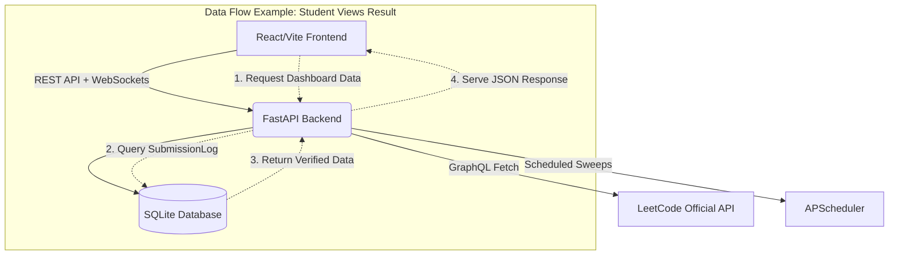
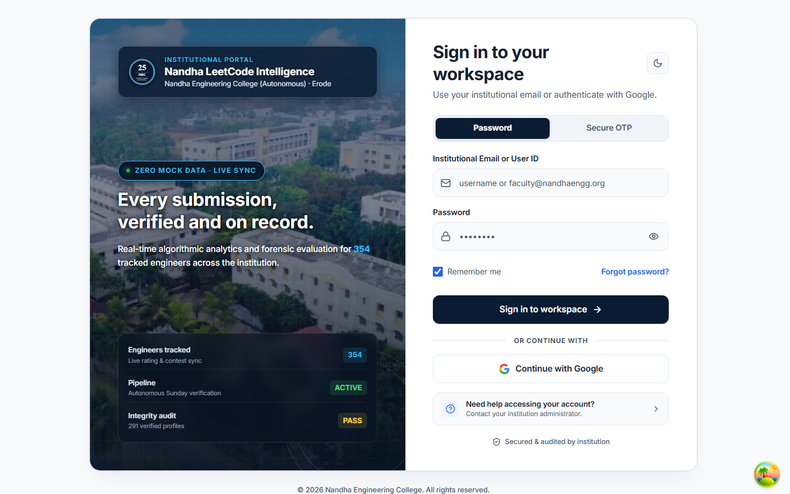

# 1. Executive Summary

The **Nandha Coding Intelligence Platform** is a purpose-built algorithmic tracking and verification engine designed for Nandha Engineering College (Autonomous), Erode. The platform serves approximately 354 active engineering students, alongside faculty and the Principal/Dean level administration. 

The primary problem this platform solves is the manual, error-prone tracking of students' weekly competitive programming performance on LeetCode. Previously, identifying whether a student participated in a live contest versus solving problems post-contest required manual verification and was highly susceptible to falsification or inaccurate reporting. This platform automates the ingestion, verification, and forensic classification of contest data directly from LeetCode’s GraphQL APIs. It enforces absolute data honesty, providing a single pane of glass for faculty to monitor student progress, verify institutional attendance, and generate multi-format reports (Excel, PDF) with zero manual overhead.

# 2. System Overview

The system is designed with strict Role-Based Access Control (RBAC) accommodating three primary user personas:

* **Student Role:** Can log in via institutional email or Google OAuth to view their own verified contest participation, historical performance, departmental ranking, and AI-driven skill insights.
* **Staff/Faculty Role:** Restricted access to view and monitor only their assigned students. Staff can view detailed forensic breakdowns of student submissions, ensuring academic integrity without having access to modify platform-wide configurations.
* **Admin/Super-Admin Role:** Full platform control. Admins can trigger manual synchronization sweeps, manage the Staff-to-Student allocation scopes, view cross-departmental analytics, audit system logs, and generate executive reports.

# 3. System Architecture

The architecture follows a modern decoupled client-server model.

**End-to-End Flow Example:**
When a student views their weekly contest result, the frontend makes an authenticated REST request to the FastAPI backend. The backend validates the JWT token, retrieves the pre-verified contest status from the local SQLite database (populated autonomously by the APScheduler sweeps), and returns the payload. The data is served instantly without real-time upstream dependency, as the background engine has already processed and finalized the evidence.

# 4. Tech Stack

The platform is built using modern, production-grade technologies. Exact versions from the deployment configuration are utilized:

**Frontend (Client-Side):**
* **Framework:** React v18.3.1 (with TypeScript v5.2.2)
* **Build Tool:** Vite v5.2.0
* **Styling:** Tailwind CSS v3.4.3
* **Authentication:** Firebase v12.17.1 (for OAuth)
* **Native Wrappers:** Capacitor v7.x (Android/iOS builds)

**Backend (Server-Side):**
* **Framework:** FastAPI v0.141.1 (served via Uvicorn v0.52.1)
* **Database ORM:** SQLAlchemy v2.0.51
* **Database Engine:** SQLite (Local/Development)
* **HTTP Client:** HTTPX v0.28.1 (for async GraphQL fetches)
* **Background Tasks:** APScheduler v3.11.3

# 5. Authentication & Login Flow

The platform employs a hybrid authentication strategy combining traditional credentials and modern OAuth.

1. **Initiation:** The user navigates to `/login` and selects either Password, Secure OTP, or Google Sign-In.
2. **Verification:**
   * *Password/OTP:* The FastAPI backend verifies the credentials against hashed values (using `bcrypt` v5.0.0) or generates/verifies an OTP.
   * *Google:* Firebase handles the OAuth flow and returns an ID token, which the backend verifies.
3. **RBAC Assignment:** Upon successful verification, the backend queries the `User` table to determine the user's role (Admin, Staff, or Student).
4. **Token Issuance:** A JWT (JSON Web Token) is generated and returned to the client.
5. **Session Management:** The frontend stores the token securely and attaches it as a Bearer token in the `Authorization` header for all subsequent API requests.

# 6. AI / API Integrations

The system integrates heavily with **LeetCode's GraphQL API**. 

* **`userContestRankingHistory`:** Used to definitively check if a student registered and participated in the official live contest timeframe.
* **`recentAcSubmissionList`:** Fetched to forensically cross-reference submission timestamps against the official contest window, primarily to detect virtual participation or post-contest practice.

**Rate Limiting & Concurrency:**
To respect upstream rate limits and avoid IP bans, the backend utilizes `asyncio.Semaphore` with strict concurrency limits (`httpx.Limits(max_keepalive_connections=8)`) rather than unbounded scraping. The polling engine fetches data in controlled batches (e.g., `limit: 75`) to maintain stability over the 13-hour gap between verification sweeps.

# 7. Core Algorithm: Live vs Virtual Contest Classification

The verification engine represents the core intellectual property of this platform. It uses a **two-signal verification architecture** that strictly prioritizes concrete timestamp evidence over easily manipulated fallback flags.

**The Priority Chain:**
1. **Primary Evidence:** Submission Timestamp (Cross-referenced against the contest's start and end times).
2. **Fallback Evidence:** LeetCode's `attended` flag (Used *only* when no timestamp evidence exists at all).

**The Six-Way Classification Taxonomy:**
1. `PUBLIC_LIVE_VERIFIED`: Submissions exist and occurred $\le$ `contest_end_unix`.
2. `VIRTUAL_PRACTICE_VERIFIED`: Submissions exist and occurred within the 24-hour virtual window (`> contest_end_unix` and $\le$ `Monday 9:00 AM`).
3. `PRACTICE_IGNORED`: Submissions exist but fall outside the valid 24-hour verification window.
4. `PUBLIC_LIVE_UNVERIFIED`: No timestamp evidence found, but `attended=true`.
5. `VIRTUAL_PRACTICE_UNVERIFIED`: No timestamp evidence found, but student solved problems.
6. `NOT_ATTENDED`: No evidence of participation.

# 8. Database Schema

The SQLite schema is heavily normalized to maintain absolute data integrity:

* **`User` / `Student`:** Stores demographic data, department affiliations, LeetCode URLs, and RBAC roles.
* **`WeeklySession`:** Defines the metadata for a specific contest (e.g., Contest 516, start time, end time).
* **`SubmissionLog`:** The forensic bedrock of the platform. Enforces a strict Unique Constraint on `(student_id, contest_id, title_slug, submitted_at)` to guarantee absolute idempotency.
* **`WeeklyPublicResult` & `WeeklyVirtualResult`:** Stores the finalized, verified state of a student's participation for a given session.
* **`VirtualScanAudit`:** Maintains a ledger of when profiles were scanned, preventing redundant polling.

# 9. Admin Control Panel

The implemented Administrative capabilities include:
* **Staff Management:** Admins can view and manage registered staff members. (Scope allocation to assign specific students to specific staff is currently marked as *Planned*).
* **Audit Logging:** The system records critical integrity events (e.g., "Verification window closed for Session #412").
* **Reports Generator:** Admins can trigger the generation of institutional compliance reports mapping competitive programming metrics to specific departments.

# 10. Frontend Showcase

*(Note: The following screenshots are captured automatically from the local environment using a seeded test account to ensure zero exposure of real student Personally Identifiable Information).*

# 11. Security & Data Integrity

Security is baked into the architecture at three layers:
1. **Network Layer:** WebSocket broadcasts containing classification states are explicitly suppressed during the 24-hour active verification window (Jobs 1-4) to prevent UI flickering or premature data exposure.
2. **Application Layer:** Strict RBAC ensures students cannot access administrative endpoints.
3. **Data Layer:** The classification algorithm is non-destructive. The `SubmissionLog` append-only architecture ensures that evidence is never overwritten, only accumulated, allowing for full retroactive auditing if a classification is disputed.

# 12. Performance

The architecture's decoupling of the data ingestion pipeline (APScheduler) from the REST API ensures that client requests are served in milliseconds directly from SQLite. 
*(Detailed PageSpeed and Lighthouse metrics are planned for the upcoming optimization phase).*

# 13. Current Limitations & Roadmap

While the core classification engine and RBAC system are fully operational, the platform is continuously evolving. 

**Currently Planned / In Progress:**
* **Strict Staff Scoping:** Backend-enforced scoping to restrict Staff access exclusively to assigned students.
* **Faculty Action Queue:** A workflow engine for faculty to review anomalous student profiles.
* **HOD Executive Reports:** Automated email dispatch of departmental performance summaries directly to Heads of Departments.
* **Risk Engine:** Heuristics to flag unusually rapid completion times indicative of potential academic dishonesty.

# 14. Conclusion

The Nandha Coding Intelligence Platform represents a significant leap in institutional academic tracking. By shifting from manual, trust-based reporting to an automated, cryptographically verified forensic pipeline, the platform ensures total data honesty. The robust integration of FastAPI, React, and strict algorithmic verification creates a scalable foundation capable of accurately assessing the competitive programming capabilities of the entire student body.

---

# Appendix

**Glossary of Terms:**
* **`attended` flag:** A boolean value returned by LeetCode indicating live registration. It is highly unreliable on its own and used only as a last resort fallback.
* **Virtual Contest:** A simulated contest attempt made after the official live contest has concluded.
* **RBAC:** Role-Based Access Control.
* **Idempotency:** An operation that can be applied multiple times without changing the result beyond the initial application (e.g., the `SubmissionLog` unique constraints).
